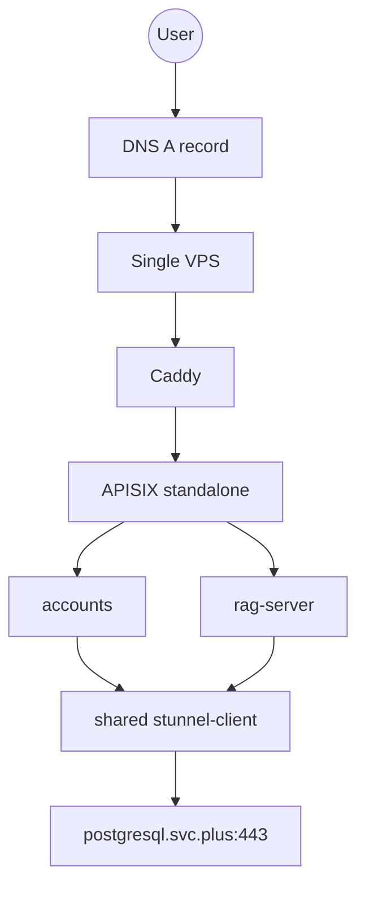

# Runbook: Cloud Run 核心服务迁移到单机 Docker Compose (2C2G)

**最后更新**: 2026-03-13
**负责人**: `@shenlan`
**目标环境**: 单机 VPS (`2 vCPU / 2 GiB RAM / 20+ GiB SSD`)

## 问题描述

如果只迁移最核心的 API 链路，而不需要 Kubernetes 的编排能力，那么在单机 VPS 上使用 `Docker + Docker Compose` 会比 `K3s` 更轻：

1. 没有 K3s / kubelet / controller / ingress controller 的控制面开销
2. 运维面更简单，适合单机、单副本、个人版发布流
3. 对当前目标服务 `accounts + rag-server + APISIX(standalone) + shared stunnel-client` 来说，资源利用率更高

本 runbook 的目标是把 Cloud Run 进一步压缩成"轻量级全栈"：

- `accounts.svc.plus`
- `rag-server.svc.plus`
- `APISIX` standalone
- `Caddy`
- 单副本 `stunnel-client`
- 可选的 `acme.sh`/外置证书挂载

## 影响范围

本次 Docker Compose 方案仅覆盖：

1. `/Users/shenlan/workspaces/cloud-neutral-toolkit/accounts.svc.plus`
2. `/Users/shenlan/workspaces/cloud-neutral-toolkit/rag-server.svc.plus`
3. 控制仓库中的单机网关编排骨架

本次明确不纳入：

- `x-scope-hub`
- `x-cloud-flow`
- `x-ops-agent`
- `openclawbot`
- `page-reading`

原因很直接：要把资源压到 `2C2G`，只能先保留最关键、最稳定、最少常驻进程的 API 组件。

## 资源评估

### 1. 平台底座

| 组件 | 常驻预估 |
| --- | --- |
| Linux + Docker Engine | `100Mi - 150Mi` |
| APISIX standalone | `180Mi - 250Mi` |
| shared `stunnel-client` | `30Mi - 60Mi` |
| 日志 / shell / page cache Buffer | `200Mi - 300Mi` |

底座合计：

- 约 `0.5Gi - 0.75Gi RAM`

### 2. 业务服务

| 服务 | 建议内存上限 | 说明 |
| --- | --- | --- |
| `accounts` | `384Mi - 512Mi` | 去掉 sidecar 后可再降一点 |
| `rag-server` | `256Mi - 384Mi` | 用共享 stunnel 后更容易控住 |

业务合计：

- 约 `0.7Gi - 0.9Gi RAM`

### 3. 结论

在 Docker Compose 形态下，整机常驻内存可以大致压到：

- **保守值**: `1.2Gi - 1.5Gi`

因此：

1. `2C2G` 可行
2. `2C4G` 会更从容
3. 比单机 K3s 更适合"个人版 Cloud Run 替代"

## 目标架构



流量模型：

- 正式流量：`stable-accounts.svc.plus` / `stable-rag-server.svc.plus`
- 调试流量：`preview-<sha>.svc.plus`

## 发布流程

```text
git push
  ↓
GitHub Actions (build image)
  ↓
Ansible deploy to VPS
  ↓
docker compose pull & up
  ↓
preview route test (optional)
  ↓
manual DNS switch
```

## 核心设计

### 1. APISIX 采用 standalone

- 不使用 etcd
- 路由通过本地 `apisix.yaml` 管理
- stable / preview 通过 upstream 目标容器名切换

### 2. 只保留一个 shared `stunnel-client`

- `accounts` 和 `rag-server` 都连接 `stunnel-client:15432`
- 不再给每个服务配 sidecar
- 大幅降低重复内存和排障复杂度

### 3. TLS / DNS 设计

**DNS Provider 凭据规则**：

- 凭据从本地 `.env` 读取
- 模板文件使用 `.env.example`（不包含实际值）
- 支持的 Provider：`cloudflare`、`aliyun`、`dnspod`

**两种部署路径**：

1. **自动化方案**（需要 DNS Provider 配置）
   - 设置 `docker_compose_lite_dns_provider` 变量
   - Ansible 会部署 DNS 更新脚本
2. **手动方案**（默认）
   - DNS A 记录手动管理
   - 证书由 `acme.sh` 或宿主机反代统一续期

## 执行步骤

### 0. 前提条件检查

```bash
# 检查 Ansible 可以连接 VPS
ansible -i ansible/inventory.ini all -m ping

# 检查 VPS 上 Docker 已安装
ansible -i ansible/inventory.ini all -a "docker --version"
```

### 1. 准备 Ansible 变量

复制变量模板并填入真实镜像与真实环境变量：

```bash
cp ansible/vars/docker_compose_lite.vps.example.yml /tmp/docker_compose_lite.vps.yml
# 编辑 /tmp/docker_compose_lite.vps.yml，替换所有 CHANGE_ME
```

**重要**：

- 不要把真实值写回仓库
- `CHANGE_ME` 和 `REPLACE_*` 不能进入实际部署阶段
- DNS Provider 凭据仍从本地 `.env` 读取，不写入 vars 文件

### 2. 配置 DNS Provider（可选）

如需自动化 DNS Provider 配置，再额外传递变量：

```yaml
# 示例：使用 Cloudflare DNS
vars:
  docker_compose_lite_dns_provider: cloudflare
  docker_compose_lite_dns_zone: svc.plus
```

或通过命令行：

```bash
ansible-playbook -i ansible/inventory.ini \
  -e @/tmp/docker_compose_lite.vps.yml \
  -e "docker_compose_lite_dns_provider=cloudflare" \
  ansible/playbooks/deploy_docker_compose_lite_migration.yml
```

### 3. 预估资源

```bash
python3 scripts/docker-compose-lite/estimate_capacity.py
```

### 4. 部署（Dry-run 预览）

```bash
# 不实际部署，只渲染和验证配置
ansible-playbook -i ansible/inventory.ini \
  -e @/tmp/docker_compose_lite.vps.yml \
  -e "docker_compose_lite_apply=false" \
  ansible/playbooks/deploy_docker_compose_lite_migration.yml --check
```

### 5. 配置渲染与真实校验（不启动容器）

```bash
# 在目标机真实执行 docker compose config，但不 pull / up
ansible-playbook -i ansible/inventory.ini \
  -e @/tmp/docker_compose_lite.vps.yml \
  -e "docker_compose_lite_apply=false" \
  ansible/playbooks/deploy_docker_compose_lite_migration.yml
```

### 6. 部署（实际执行）

```bash
# 实际部署到 VPS
ansible-playbook -i ansible/inventory.ini \
  -e @/tmp/docker_compose_lite.vps.yml \
  ansible/playbooks/deploy_docker_compose_lite_migration.yml
```

### 7. 验证

```bash
# SSH 到 VPS 后执行
bash /opt/cloud-neutral/docker-compose-lite/verify_stack.sh

# 或使用 Ansible
ansible -i ansible/inventory.ini all -a "cd /opt/cloud-neutral/docker-compose-lite && docker compose -p cn-toolkit-lite ps"
```

## 验证检查点

1. `docker compose ps` - 所有服务状态为 running
2. `docker stats --no-stream` - 内存使用在预算内
3. `curl http://127.0.0.1/` - Caddy 可访问
4. `curl http://127.0.0.1:9180/apisix/admin/routes` - APISIX 路由可访问
5. `nc -z 127.0.0.1 15432` - stunnel 端口可访问
6. `accounts` / `rag-server` 无持续重启

## DNS 规则

- 安装、部署、运行态验证都可以执行
- 在迁移 readiness 明确前，不做 DNS 变更
- DNS 只保留为最后的人工切流步骤

## 风险点

1. Docker Compose 没有 K8s 的声明式自愈能力，必须依赖 `restart: unless-stopped` 和外部监控。
2. APISIX standalone 轻量，但路由变更要靠文件更新与容器 reload，不像 K8s Ingress 那么统一。
3. shared `stunnel-client` 仍是单点，必须单独监控。
4. `2C2G` 够用，但不适合继续叠加更多常驻服务。
5. DNS 切换需要人工确认，切流前务必验证新栈健康。

## 回滚计划

1. 人工确认：将 DNS A 记录切回原 Cloud Run 域名入口
2. 在 VPS 上执行：`docker compose -p cn-toolkit-lite down`
3. 保留 `/opt/cloud-neutral/docker-compose-lite/env/` 下的 `.env` 文件做问题排查
4. 根据日志修复后再重新部署

## 文件位置

- Ansible Playbook: `ansible/playbooks/deploy_docker_compose_lite_migration.yml`
- Ansible Role: `ansible/roles/docker_compose_lite_migration/`
- Docker Compose: `deploy/docker-compose-lite/docker-compose.yaml`
- 验证脚本: `scripts/docker-compose-lite/verify_stack.sh`
- 容量估算: `scripts/docker-compose-lite/estimate_capacity.py`
