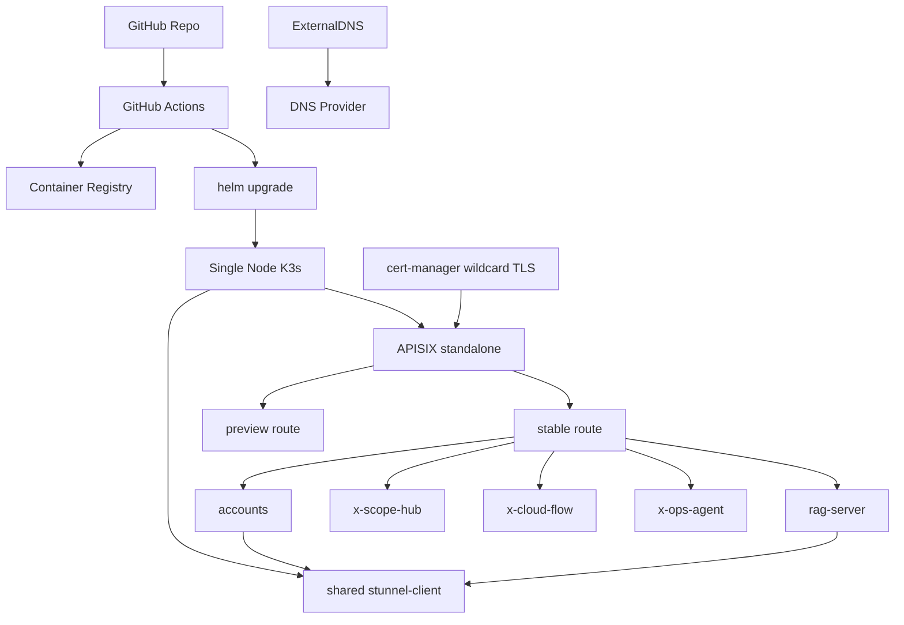

# Runbook: Cloud Run 核心服务迁移到单机 K3s (2C4G)

**最后更新**: 2026-03-13
**负责人**: `@shenlan`
**目标环境**: 单机 VPS (`2 vCPU / 4 GiB RAM / 40+ GiB SSD`)

## 问题描述

当前核心服务运行在 Cloud Run，上线简单但存在三个长期问题：

1. 常驻控制面服务会被 Cloud Run 的无状态与冷启动模型拖慢。
2. 多服务间依赖越来越像常驻集群，而不是纯按请求拉起的函数。
3. `accounts -> rag -> x-scope-hub -> x-cloud-flow -> x-ops-agent` 这条链路迁移到单机 K3s 后，运维控制面会更统一。

本方案采用“极简 Cloud Run 个人版”思路：

1. GitHub Actions 负责构建镜像、推送镜像仓库、执行 `helm upgrade`
2. APISIX 使用 standalone 模式，不引入 etcd
3. `cert-manager` 负责 `*.deploy.<domain>` 证书
4. `ExternalDNS` 负责 stable / preview 路由的 DNS 自动登记
5. 预览环境通过 `preview-<sha>.svc.plus` 暂时挂载，而不是长驻第二套平台

本 runbook 目标是在 `2C4G` 机器上落地以下组件：

- `K3s`
- `APISIX`
- `ExternalDNS`
- `cert-manager`
- 核心服务 `Deployment + Service + Ingress`

## 影响范围

本次迁移只覆盖以下核心服务仓库：

1. `/Users/shenlan/workspaces/cloud-neutral-toolkit/accounts.svc.plus`
2. `/Users/shenlan/workspaces/cloud-neutral-toolkit/rag-server.svc.plus`
3. `/Users/shenlan/workspaces/cloud-neutral-toolkit/x-scope-hub.svc.plus`
4. `/Users/shenlan/workspaces/cloud-neutral-toolkit/x-cloud-flow.svc.plus`
5. `/Users/shenlan/workspaces/cloud-neutral-toolkit/x-ops-agent.svc.plus`

本次不纳入 `2C4G` 首批迁移：

- `openclawbot`
- `page-reading`
- `preview-accounts`

原因是这几个服务会显著挤压单机内存 Buffer，导致 APISIX 或 K3s 本身被 OOM 驱逐。

## 资源评估

### 1. 基础设施常驻预算

| 组件 | 建议 Request | 建议 Limit | 常驻说明 |
| --- | --- | --- | --- |
| Linux + K3s + containerd | `350m / 700Mi` | `600m / 1024Mi` | 含 kubelet、sqlite/etcd 开销 |
| APISIX | `200m / 256Mi` | `500m / 384Mi` | 单节点单副本 |
| cert-manager | `80m / 96Mi` | `200m / 160Mi` | controller + webhook + cainjector |
| ExternalDNS | `30m / 48Mi` | `100m / 80Mi` | 单副本即可 |
| shared `stunnel-client` | `50m / 64Mi` | `100m / 128Mi` | 集群唯一 DB TLS client |
| OS cache / shell / logrotate Buffer | `0m / 384Mi` | `0m / 384Mi` | 不应被业务吃光 |

基础设施合计：

- Request 约 `660m CPU / 1.08Gi RAM`
- 带 Buffer 的最低保留内存约 `1.46Gi RAM`

### 2. 核心服务在 2C4G 上的建议预算

下表不是直接照搬 Cloud Run limit，而是按“单副本常驻、低并发、无 HPA”的 K3s 形态重新收敛后的建议值：

| 服务 | 当前参考上限 | 2C4G 建议 Request | 2C4G 建议 Limit | 说明 |
| --- | --- | --- | --- | --- |
| `accounts` | `1.2 vCPU / 640Mi` | `220m / 320Mi` | `700m / 512Mi` | 不再挂 sidecar，统一走共享 `stunnel-client` |
| `rag-server` | `1 vCPU / 512Mi` | `180m / 224Mi` | `500m / 448Mi` | 统一走共享 `stunnel-client` |
| `x-scope-hub` | `1 vCPU / 512Mi` | `200m / 256Mi` | `400m / 384Mi` | 以只读观测为主 |
| `x-cloud-flow` | `1 vCPU / 512Mi` | `150m / 192Mi` | `400m / 320Mi` | 首批只跑 plan/read-only 能力 |
| `x-ops-agent` | `1 vCPU / 512Mi` | `150m / 192Mi` | `400m / 320Mi` | 按低频控制面使用估算 |

应用合计：

- Request 约 `950m CPU / 1.25Gi RAM`
- Limit 约 `2.6Gi RAM`

### 3. 2C4G 是否可行

结论分两层看：

1. **按 Request 看，可行**  
   基础设施 + 核心服务 Request 合计约 `1.61 vCPU / 2.33Gi RAM`，在 `2C4G` 上可以跑。
2. **按峰值看，依然非常紧**  
   基础设施高位 + 核心服务 Limit 合计接近 `4Gi RAM`，这意味着：
   - 只能单副本
   - 不能再带 `preview-accounts`
   - 不能同时上 `openclawbot` 和 `page-reading`
   - 必须把日志、镜像缓存、APISIX reload、证书续期带来的瞬时峰值算进去
   - 共享 `stunnel-client` 虽然比双 sidecar 更省，但仍会吃掉一部分固定内存

### 4. 实际建议

`2C4G` 只适合作为“核心控制面最小可用版”：

- 保留：`accounts`, `rag-server`, `x-scope-hub`, `x-cloud-flow`, `x-ops-agent`
- 严格限制：全部单副本，关闭 HPA，控制日志量
- 推荐：数据库独立于这台机器，避免本机再跑 PostgreSQL
- 建议升级阈值：当 `memory working set` 长期超过 `3.1Gi` 时，升级到 `4C8G`

## 目标拓扑



路由约定：

- stable: `stable-<service>.svc.plus`
- preview: `preview-<gitsha>.svc.plus`

流量模型：

### 正式流量

`stable-xxx.svc.plus` -> `APISIX` -> `stable Service` -> `current Deployment`

### Preview 调试

`preview-<sha>.svc.plus` -> `APISIX` -> `preview Service` -> `new Deployment`

## 迁移策略

### Phase 0: 预检查

1. 降低所有待切换域名 TTL 到 `60s`
2. 确认每个仓库都有：
   - `Dockerfile`
   - `.env.example`
   - 健康检查路径
   - 可独立启动的 `PORT=8080`
3. 检查是否仍依赖 Cloud Run 特性：
   - OIDC 调用链
   - Secret Manager 注入
   - Stunnel sidecar

4. 把数据库连接统一改为：
   - `DB_HOST=stunnel-client.core-platform.svc.cluster.local`
   - `DB_PORT=15432`

### Phase 1: 建基础设施

1. 安装 K3s
2. 安装 APISIX Ingress Controller
3. 安装 cert-manager
4. 安装 ExternalDNS
5. 创建命名空间：`infra-system`、`core-platform`
6. 创建 ClusterIssuer：`letsencrypt-prod`

### Phase 2: 先迁最小依赖链

顺序建议：

1. `accounts.svc.plus`
2. `rag-server.svc.plus`
3. `x-scope-hub.svc.plus`
4. `x-cloud-flow.svc.plus`
5. `x-ops-agent.svc.plus`

说明：

- `accounts` 先落地，用于内部身份与审计链路稳定。
- `rag-server` 第二个落地，便于验证 DB/内部访问路径。
- `x-scope-hub`、`x-cloud-flow`、`x-ops-agent` 属于控制平面服务，最后切换更安全。

### Phase 3: 灰度切流

每个服务按同一套路执行：

1. 先在 K3s 内部 `ClusterIP` 验证
2. 再经 APISIX 域名验证
3. 最后更新 DNS 到 VPS
4. 观察 `15-30` 分钟后再切下一个服务

## 配置原则

### Secrets

- 不要把 Cloud Run 中的明文环境变量直接抄进 Git
- 所有敏感项通过 `Secret` 或外部密钥系统注入
- 控制仓库中只保留：
  - `.env.example`
  - `Secret` 模板占位符
- DNS provider key 虽然当前放在本地 `.env`，但只能作为部署输入源，不能写入仓库
- `ExternalDNS` 的 provider key 应通过脚本从本地 `.env` 生成 `Kubernetes Secret`

### 数据库

- `accounts` 优先改为直连 PostgreSQL，而不是继续保留 Cloud Run 风格的 `stunnel-sidecar`
- `accounts` 和 `rag-server` 都通过一个共享的 `stunnel-client` Deployment 访问 DB TLS 入口
- `stunnel-client` 通过 `Service` 暴露 `15432`，业务 Pod 不再各自维护 sidecar
- `2C4G` 主机上不建议同时承载 DB + K3s + APISIX + 5 个服务

### K8s 资源限制

- 所有 Deployment 初始副本数固定为 `1`
- 不启用 HPA
- 统一启用：
  - `readinessProbe`
  - `livenessProbe`
  - `requests`
  - `limits`
  - `revisionHistoryLimit: 2`

### APISIX / Preview 约束

- APISIX 使用 standalone 配置，不额外维护 etcd
- preview 只保留最近一次候选版本，不做多版本并行池化
- stable 域名建议统一收敛为 `stable-<service>.svc.plus`
- preview 域名建议统一收敛为 `preview-<sha>.svc.plus`
- preview 验证完成后：
  - 切换 stable route
  - 删除 preview Ingress 与 preview Service

## 执行步骤

### 1. 生成迁移清单骨架

在控制仓库执行：

```bash
python3 scripts/k3s-migration/estimate_capacity.py
python3 scripts/k3s-migration/render_manifests.py --output-dir /tmp/k3s-core
python3 scripts/k3s-migration/render_externaldns_secret.py --env-file .env --output /tmp/k3s-core/externaldns-secret.yaml
```

### 2. 部署基础设施

```bash
curl -sfL https://get.k3s.io | sh -
kubectl create namespace infra-system
kubectl create namespace core-platform
```

随后按顺序安装：

1. APISIX
2. cert-manager
3. ExternalDNS
4. 导入 `externaldns-secret.yaml`
5. 部署共享 `stunnel-client`

### 3. 导入应用 Secret

按每个仓库的 `.env.example` 生成对应 Secret：

```bash
kubectl -n core-platform apply -f /tmp/k3s-core/secrets/
```

### 4. 部署应用

```bash
kubectl -n core-platform apply -f /tmp/k3s-core/accounts/
kubectl -n core-platform apply -f /tmp/k3s-core/rag-server/
kubectl -n core-platform apply -f /tmp/k3s-core/x-scope-hub/
kubectl -n core-platform apply -f /tmp/k3s-core/x-cloud-flow/
kubectl -n core-platform apply -f /tmp/k3s-core/x-ops-agent/
kubectl -n core-platform apply -f /tmp/k3s-core/infra/
```

### 5. 切 DNS

1. 先确认 APISIX 上证书已就绪
2. 切换 A 记录到 VPS
3. 验证健康检查与主功能

### 6. GitHub Actions 部署环

极简流程推荐固定为：

1. `docker build`
2. `docker push`
3. `helm upgrade --install`
4. 创建 preview route
5. 使用 `preview-<sha>.svc.plus` 做验收
6. 验收通过后切换 stable route

对应发布流程：

`git push` -> `GitHub Actions` -> `build image` -> `helm upgrade deployment` -> `preview route created` -> `preview domain test` -> `switch stable route`

### 7. DNS / TLS 自动化

`ExternalDNS` 自动创建：

- `stable-<service>.svc.plus`
- `preview-<sha>.svc.plus`

`cert-manager` 自动签发：

- `*.svc.plus`

### 8. Ansible 角色化

迁移部署与验证逻辑建议落成可复用的 Ansible role，而不是继续保留为独立脚本：

- 参考仓库：`/Users/shenlan/workspaces/cloud-neutral-toolkit/playbooks`
- 本控制仓库已提供可迁移骨架：
  - `/Users/shenlan/workspaces/cloud-neutral-toolkit/github-org-cloud-neutral-toolkit/ansible/playbooks/deploy_k3s_core_migration.yml`
  - `/Users/shenlan/workspaces/cloud-neutral-toolkit/github-org-cloud-neutral-toolkit/ansible/roles/k3s_core_migration/`

推荐复用方式：

1. 把 role 复制到 `playbooks/roles/`
2. 在目标 playbook 中 `include_role: name: k3s_core_migration`
3. 通过 inventory / group_vars 注入：
   - 镜像 tag
   - preview sha
   - DNS provider secret
   - 各服务 secret/config

为了更适合 `ansible-playbook -C -D`，role 已经拆分为：

1. `render` 阶段
2. `diff / preview` 阶段
3. `apply` 阶段
4. `verify` 阶段

建议预演命令：

```bash
ANSIBLE_CONFIG=ansible/ansible.cfg \
ansible-playbook ansible/playbooks/deploy_k3s_core_migration.yml -C -D
```

## 验证方法

### 基础设施

- `kubectl get pods -A`
- `kubectl top nodes`
- `kubectl top pods -A`
- `kubectl get certificate -A`
- `kubectl -n infra-system get secret externaldns-provider -o yaml`

### 服务级验证

- `accounts`: 登录、会话、健康检查
- `rag-server`: 检索 / 健康检查
- `x-scope-hub`: 健康检查、只读观测接口
- `x-cloud-flow`: 只读 plan 或 health endpoint
- `x-ops-agent`: 健康检查、metrics、基础 API

### 资源红线

出现以下任一项就说明 `2C4G` 已经顶满：

1. 节点可用内存长期低于 `500Mi`
2. APISIX Pod 被驱逐
3. `cert-manager` webhook 经常超时
4. 任一核心服务 `OOMKilled`

## 回滚计划

按反向顺序回滚：

1. `x-ops-agent`
2. `x-cloud-flow`
3. `x-scope-hub`
4. `rag-server`
5. `accounts`
6. 最后回滚 DNS 到 Cloud Run

单服务回滚步骤：

1. 把域名切回原 Cloud Run URL 对应的网关层
2. 保留 K3s Pod 但停止外部流量
3. 导出故障时的 `kubectl describe`、`logs`、`events`
4. 修复后重新灰度

## 风险清单

1. `2C4G` 仅够跑“最小可用核心链路”，不适合继续叠加新服务。
2. `accounts` 和 `rag-server` 当前都带有 Cloud Run 时代的数据库连接假设，迁移时要优先去掉 sidecar 依赖。
3. `x-cloud-flow` 与 `x-ops-agent` 都属于控制面执行器，若直接开放公网入口，必须补齐鉴权与 IP/来源限制。
4. 某些 Cloud Run 环境变量当前可能混有敏感值，迁移时必须先清洗为 K8s Secret 注入。
5. preview 路由如果不做自动清理，`2C4G` 很快会被多余 Deployment 吃满。
6. 共享 `stunnel-client` 是单点，必须配套健康检查与明确回滚步骤。
