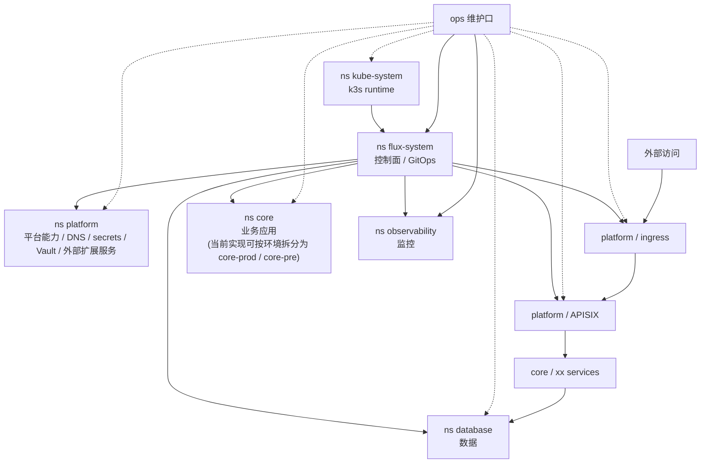

# Runbook: JP-XHTTP Contabo -> JP-K3S Vultr Migration

**Last updated**: 2026-04-02  
**Owner**: `@shenlan`  
**Goal**: move the active single-node source host `root@jp-xhttp-contabo.svc.plus` to the new target host `root@jp-k3s-vultr.svc.plus` with minimal downtime, while keeping the source host untouched until the final DNS cutover.
**Target deployment mode**: `k3s_platform`

> This runbook is a low-downtime migration plan, not a destructive rebuild plan.
> The source host remains the rollback anchor until the very end.

## Scope

- Source host: `root@jp-xhttp-contabo.svc.plus`
- Target host: `root@jp-k3s-vultr.svc.plus`
- Target deployment mode: `k3s_platform`
- Target platform bootstrap: `playbooks/init_k3s_single_node_gitops.yml`
- Target GitOps base: `gitops/infra/clusters/prod`
- Services in scope:
  - `k3s_platform_bootstrap`
  - `Vault`
  - Flux GitOps sync
  - `stunnel-client`
  - `stunnel-server`
  - `postgresql-svc-plus`
  - DNS records for public traffic

## Migration Strategy

Use a blue/green style migration:

1. Build the target platform first.
2. Bring up or migrate Vault on the target.
3. Let Flux sync the full platform and workloads.
4. Move DB services and data with a final short write-freeze window.
5. Switch DNS last.
6. Keep the source host intact for rollback until the new host is validated.

## Vault Mode

The bootstrap role now supports two Vault modes:

- `init`
  - For a fresh target Vault that has never been initialized.
  - Prints init material only when `k3s_platform_vault_allow_sensitive_output=true`.
  - Writes init JSON to `/tmp/vault-init.json` on the target host.
- `migrate`
  - For an already initialized Vault instance that needs to be taken over or reseeded.
  - Requires external inputs:
    - `vault_root_token`
    - `vault_init_json`
  - Does not re-run `vault operator init`.

Recommended rule:

- If the target Vault is empty, use `init`.
- If you are reusing an existing Vault identity or reseeding from prior material, use `migrate`.

## Service Topology



Logical line split during migration:

- 外部访问线：公网入口按 `外部访问 -> ingress -> APISIX -> xx` 进入，再由业务服务访问 `database`。
- ops 维护口：运维通过 `SSH / kubectl / flux / Grafana` 进入，优先连接 `flux-system` 与 `observability`，必要时再下探到其他 namespace。
- 当前实现仍可能保留 `extsvc`、`core-prod`、`core-pre` 等物理 namespace；本 runbook 采用的是目标口径与逻辑分层图。

| Layer | Service | Target | Notes |
| --- | --- | --- | --- |
| Platform | `k3s_platform_bootstrap` | `jp-k3s-vultr.svc.plus` | Host bootstrap and GitOps seed |
| Platform service | `Vault` | `jp-k3s-vultr.svc.plus` | Logically folded into `platform`; must be ready before full GitOps sync |
| DB tunnel | `stunnel-client` | shared pod / namespace | Shared DB endpoint for workloads |
| DB tunnel | `stunnel-server` | `jp-k3s-vultr.svc.plus` | External DB TLS endpoint |
| Database | `postgresql-svc-plus` | `jp-k3s-vultr.svc.plus` | Primary DB runtime |
| Traffic | DNS | Cloudflare / public DNS | Switched only after validation |

## Preconditions

- Source host is reachable and stays read-only from the migration operator perspective.
- Target host is reachable via SSH.
- GitOps auth material and Vault inputs are available through environment variables or safe references.
- The migration operator can read the current source state and take backups.
- A short final write freeze is acceptable for the DB cutover.

## Phase 0: Preflight

- Confirm SSH access to both hosts.
- Capture current state from the source:
  - `docker ps -a`
  - `docker compose ps` if applicable
  - `ss -ltnp`
  - current DNS records and TTLs
  - Vault status and DB status
- Confirm the target host has enough disk and memory for k3s + Vault + DB.
- Lower DNS TTL ahead of cutover if needed.

## Phase 1: Bootstrap the Target Platform

Run the target bootstrap with the new host label.
The new host uses the `k3s_platform` deployment mode, not the legacy one-off bootstrap label.

Recommended command shape:

```bash
cd /Users/shenlan/workspaces/cloud-neutral-toolkit/playbooks
ANSIBLE_CONFIG=../github-org-cloud-neutral-toolkit/ansible/ansible.cfg \
ansible-playbook -i inventory.ini init_k3s_single_node_gitops.yml \
  -l jp-k3s-vultr.svc.plus \
  -D \
  -e @vars/k3s_platform_svc_plus.yml
```

For Vault mode selection:

- fresh target: `K3S_PLATFORM_VAULT_BOOTSTRAP_MODE=init`
- reuse / takeover flow: `K3S_PLATFORM_VAULT_BOOTSTRAP_MODE=migrate`

## Phase 2: Vault Bootstrap or Migration

### Option A: `init`

Use this when the target Vault is empty.

Steps:

1. Run the target bootstrap in `init` mode.
2. Collect the init outputs:
   - `root_token`
   - `init_json`
   - default admin username: `admin`
3. Store sensitive material outside the repo.
4. Verify Vault is unsealed and reachable before continuing.

### Option B: `migrate`

Use this when you are reseeding or taking over an already initialized Vault identity.

Steps:

1. Collect the source Vault material from the existing source environment.
2. Provide the following to the target bootstrap:
   - `vault_root_token`
   - `vault_init_json`
3. Run the target bootstrap in `migrate` mode.
4. Verify the target Vault reports `initialized=true` and is reachable.

Important:

- Do not re-run `vault operator init` in `migrate` mode.
- Do not mutate the source host until the target is verified.

## Phase 3: Full GitOps Sync

After Vault is ready:

1. Let Flux reconcile the root `GitRepository` and `Kustomization`.
2. Wait for all namespaces to exist.
3. Wait for all platform pods to become ready.
4. Verify that app workloads, secrets, and ingress resources are synced.

Recommended checks:

- `kubectl get gitrepositories,kustomizations,helmreleases -A`
- `kubectl get pods -A`
- `kubectl get ns`
- service-specific health endpoints

## Phase 4: DB Migration

Move the DB stack in a controlled sequence:

1. `stunnel-server`
2. `postgresql-svc-plus`
3. `stunnel-client`

Recommended pattern:

1. Bring up the target DB stack without cutting traffic.
2. Perform an initial full sync from the source DB.
3. Validate schema, row counts, and critical application queries.
4. Freeze writes on the source briefly.
5. Perform a final delta or repeat full restore, depending on data size and tooling.
6. Switch application DB endpoints to the target `stunnel-client`.

Validation examples:

- compare row counts for key tables
- compare schema checksums
- run app health checks against the target DB
- confirm `stunnel-client` resolves from workloads

## Phase 5: DNS Cutover

Only after platform, Vault, Flux, and DB are healthy:

1. Update DNS to point public traffic to the target host.
2. Keep TTL low during the cutover window.
3. Verify public health checks.
4. Monitor logs and DB connections.

## Phase 6: Post-Cutover Observation

- Keep the source host intact for a rollback window.
- Do not immediately delete source data or services.
- Watch for:
  - 5xx spikes
  - Vault auth failures
  - DB connection failures
  - stale DNS caches
  - Flux reconciliation errors

## Rollback Plan

Rollback order is the reverse of cutover:

1. Repoint DNS back to the source host.
2. Stop target write traffic.
3. Revert DB endpoint consumers to the source DB stack.
4. Revert Flux / GitOps state if needed.
5. Preserve target Vault init or migrate artifacts for forensic review.

## Execution Log

Use this table during the actual migration window:

| Field | Value |
| --- | --- |
| Window | `TBD` |
| Source | `root@jp-xhttp-contabo.svc.plus` |
| Target | `root@jp-k3s-vultr.svc.plus` |
| Vault mode | `init` / `migrate` |
| DB mode | `initial sync + final freeze + cutover` |
| DNS TTL | `TBD` |
| Result | `TBD` |
