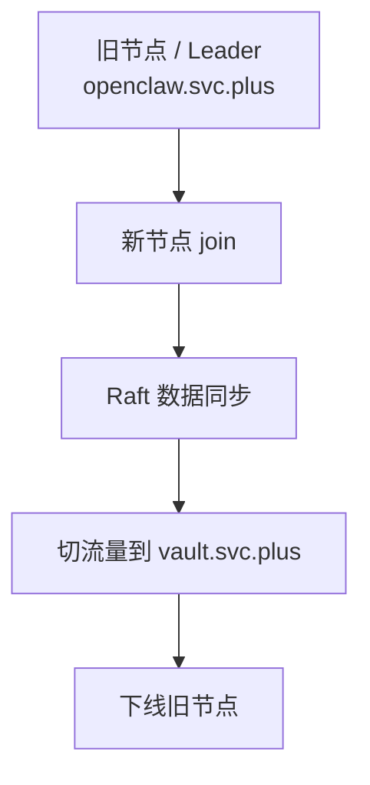

# Runbook: Vault Raft Join Migration

**最后更新**: 2026-03-31  
**负责人**: `@shenlan`  
**适用场景**: 将一个已初始化、已运行的 Vault OSS Raft 集群从旧主机平滑迁移到新主机，采用 `raft join -> 数据同步 -> 切流量 -> 下线旧节点` 的方式完成 host-level 切换。

> 本文记录的是这次真实迁移的标准流程和现场结果。  
> 实例主机：
> - 旧节点 / 原 leader: `root@openclaw.svc.plus`
> - 新节点 / 目标主机: `root@jp-xhttp-contabo.svc.plus`
> - 对外入口: `https://vault.svc.plus`

## 目标

当 Vault 已经在运行并且数据不能丢失时，不要重新 `vault operator init`，而是：

1. 临时让旧 leader 的 Raft 入口对新节点可达
2. 新节点使用 `retry_join` 加入现有集群
3. 让 Raft 数据自动同步到新节点
4. 切换 `vault.svc.plus` 流量到新主机
5. 下线旧节点，并恢复配置到稳定态

## 适用前提

这条流程只适用于以下情况：

- 现有 Vault 已经 `initialized=true`
- 现有 Vault 已经 `sealed=false`
- 旧节点仍然可访问，并且还能作为 join 源
- 目标节点有足够磁盘空间和稳定网络
- 原始 unseal material 仍然可用

不适用的情况：

- 你要创建一个全新的空 Vault 集群
- 你已经丢失 Raft 数据目录
- 你没有任何原始 unseal material
- 你不确定当前访问到的到底是不是同一个集群

## 拓扑



## 相关文件

- [ansible/roles/vault_release_deploy/tasks/main.yml](/Users/shenlan/workspaces/cloud-neutral-toolkit/github-org-cloud-neutral-toolkit/ansible/roles/vault_release_deploy/tasks/main.yml)
- [ansible/roles/vault_release_deploy/templates/site.caddy.j2](/Users/shenlan/workspaces/cloud-neutral-toolkit/github-org-cloud-neutral-toolkit/ansible/roles/vault_release_deploy/templates/site.caddy.j2)
- [openclaw-deploy-example/deploy/vault/vault.svc.plus.caddy](/Users/shenlan/workspaces/cloud-neutral-toolkit/github-org-cloud-neutral-toolkit/openclaw-deploy-example/deploy/vault/vault.svc.plus.caddy)
- [openclaw-deploy-example/deploy/vault/README.md](/Users/shenlan/workspaces/cloud-neutral-toolkit/github-org-cloud-neutral-toolkit/openclaw-deploy-example/deploy/vault/README.md)

## 现场配置要点

### Vault

- Vault 监听宿主机 `8200/8201`
- 数据目录: `/opt/vault/data`
- 配置文件: `/opt/vault/config/vault.hcl`
- Docker 网络模式: `host`
- 容器名称: `vault`

### Caddy

对外统一通过 Caddy 提供入口：

```caddy
vault.svc.plus {
  encode zstd gzip
  reverse_proxy 127.0.0.1:8200
  header {
    X-Content-Type-Options "nosniff"
    X-Frame-Options "DENY"
    Referrer-Policy "no-referrer"
  }
}
```

Ansible 会把同样的站点块写到：

- `/etc/caddy/conf.d/vault.svc.plus.caddy`

并由主 `Caddyfile` 通过 `import` 引入。

## 预检清单

迁移前先确认这些状态：

```bash
ssh root@openclaw.svc.plus
docker exec vault /bin/vault status -format=json
docker exec vault /bin/vault operator raft list-peers

ssh root@jp-xhttp-contabo.svc.plus
docker exec vault /bin/vault status -format=json
docker exec vault /bin/vault operator raft list-peers

dig +short vault.svc.plus @1.1.1.1
dig +short vault.svc.plus @8.8.8.8
```

建议确认：

- 旧节点状态正常，仍然是 leader 或至少是可 join 的活节点
- 新节点没有残留旧数据污染
- DNS 记录可以在切流量时快速更新
- 原始 unseal material 可以立即取用

## 迁移流程

### 1. 备份当前集群状态

在旧 leader 上先做一次 raft snapshot，避免切换过程中出现回滚无依据的问题。

```bash
export VAULT_ADDR=https://vault.svc.plus
export VAULT_TOKEN="$VAULT_SERVER_ROOT_ACCESS_TOKEN"

mkdir -p /root/vault-backups
vault operator raft snapshot save \
  "/root/vault-backups/vault-$(date +%F-%H%M%S).snap"
```

同时记录：

- 当前 `vault status`
- 当前 `vault operator raft list-peers`
- 当前 `vault.svc.plus` DNS 解析结果

### 2. 让旧 leader 的 Raft 入口临时可达

如果旧节点的 Raft 监听只绑在 `127.0.0.1:8201`，新节点无法直接 join。  
这时要把旧节点临时改成可被新节点访问的地址。

典型做法有两种：

1. **直接暴露 Raft 端口**
   - 临时把旧节点 `cluster_addr` / listener cluster address 改为 `0.0.0.0:8201`
   - 仅在内网或受控网络中使用

2. **SSH 隧道桥接**
   - 如果不能直接改网络暴露，就临时用 SSH tunnel 桥接旧 leader 的 `8200` / `8201`
   - 让新节点把 `retry_join.leader_api_addr` 指向这个临时隧道端点

实际执行时优先选最小暴露面方案。  
如果能用临时隧道完成 join，就不要把旧节点长期暴露到公网。

### 3. 启动新节点并执行 `retry_join`

在新节点上把 Vault 指向现有 leader，然后启动服务。

配置要点：

- `retry_join` 指向旧 leader 的 API 入口
- `api_addr` 应该是对外最终入口或节点可达地址
- `cluster_addr` 必须能被其它 raft peer 访问
- 数据目录应该是新的、干净的

示例思路：

```hcl
storage "raft" {
  path = "/opt/vault/data"

  retry_join {
    leader_api_addr = "<old-leader-api-or-tunnel-endpoint>"
  }
}
```

启动后在新节点检查：

```bash
docker ps --filter name=vault
docker logs -f vault
docker exec vault /bin/vault status -format=json
docker exec vault /bin/vault operator raft list-peers
```

### 4. 等待数据自动同步

同步阶段的重点是确认新节点不是“空壳”，而是真的在追赶同一集群。

检查项：

- `vault status` 返回 `initialized=true`
- `sealed=false`
- `vault operator raft list-peers` 能看到旧节点和新节点
- Raft `committed_index` / `applied_index` 持续推进并逐渐对齐
- 新节点不再持续重试 join

实际可用的验证命令：

```bash
docker exec vault /bin/vault status -format=json | jq
docker exec vault /bin/vault operator raft list-peers
curl -sk "https://vault.svc.plus/v1/sys/health?standbyok=true&sealedcode=503&uninitcode=503" | jq
```

### 5. 解封新节点

如果新节点在同步后仍然是 sealed，就用原始 cluster unseal material 解封。

```bash
export VAULT_ADDR=http://127.0.0.1:8200
vault operator unseal -address="$VAULT_ADDR" "<unseal-key>"
```

注意：

- 不要在新节点上重新 `vault operator init`
- 只在确认它加入了现有集群以后才做 unseal
- 如果不确定它是否已经 join 成功，先查 `raft list-peers`

### 6. 切换 `vault.svc.plus` 流量

确认新节点健康后，切换 DNS 或反向代理入口到新主机。

这次迁移的实际切换点是：

- `vault.svc.plus` 指向 `jp-xhttp-contabo.svc.plus`
- Caddy 仍然反代到本机 `127.0.0.1:8200`
- 公网证书由 Caddy 自动获取

常用验证：

```bash
dig +short vault.svc.plus @1.1.1.1
dig +short vault.svc.plus @8.8.8.8
curl -sk https://vault.svc.plus/v1/sys/health?standbyok=true
```

期望结果：

- DNS 已经指向新主机
- `vault.svc.plus` 返回 `200`
- `initialized=true`
- `sealed=false`
- `standby=false`

### 7. 下线旧节点

切流量稳定后，逐步下线旧节点：

```bash
ssh root@openclaw.svc.plus
systemctl stop caddy || true
docker stop vault || true
docker rm vault || true
```

然后把旧节点配置恢复到安全的稳定态，至少保证：

- `cluster_addr` 回到 loopback 或者关闭
- 不再接受新的 raft join
- 旧节点不再对外承担流量

如果旧节点还要保留为应急回退节点，可以先只停流量，不立即删除数据目录。

## 验证清单

切换完成后，至少检查以下内容：

```bash
ssh root@jp-xhttp-contabo.svc.plus
docker exec vault /bin/vault status -format=json | jq
docker exec vault /bin/vault operator raft list-peers
curl -sk https://vault.svc.plus/v1/sys/health?standbyok=true&sealedcode=503&uninitcode=503 | jq
caddy validate --config /etc/caddy/Caddyfile
systemctl status caddy --no-pager
```

通过标准：

- 新节点 `sealed=false`
- 新节点 `initialized=true`
- Raft peer 列表里能看到目标节点
- `vault.svc.plus` 访问正常
- Caddy 配置校验通过

## 回滚计划

回滚原则只有一句：

> 如果切流量后出现异常，优先把入口切回旧节点，前提是旧节点仍然保持完整的 Raft 数据。

### 回滚步骤

1. 立即把 `vault.svc.plus` DNS 或反代改回旧节点
2. 确认旧节点还在运行并且数据未被破坏
3. 停止新节点对外入口，保留现场以便排查
4. 若新节点已经接受了写入，再考虑是否需要重新同步或恢复 snapshot

### 回滚边界

- 如果切换后已经产生新的写入，不要盲目把旧节点当成真相源
- 如果旧节点的数据已经过期，回滚前先判断是否会丢失有效 secret
- 任何涉及 `operator init` 的操作都不属于回滚，而是重建

## 常见问题

### 1. 浏览器进入初始化页

这通常表示：

- 你连到的是一个空数据目录的 Vault
- 或者入口已经切到新主机，但新主机的 Vault 数据没有正确带上
- 或者实际上访问到了错误的 upstream

检查顺序：

1. `docker exec vault /bin/vault status -format=json`
2. `docker exec vault /bin/vault operator raft list-peers`
3. `curl -sk https://vault.svc.plus/v1/sys/health`
4. `caddy validate --config /etc/caddy/Caddyfile`

### 2. 新节点 join 不上

优先检查：

- 旧 leader 的 `8201` 是否真的可达
- `leader_api_addr` 是否指到了正确的入口
- `retry_join` 配置是否和实际 TLS / HTTP 方式一致
- 新节点数据目录是否为空

### 3. `vault.svc.plus` 返回 502

优先检查：

- Caddy 是否已经 reload
- Caddy site 文件是否存在
- Vault 进程是否在监听 `127.0.0.1:8200`
- DNS 是否真的指向了新主机

## 迁移结果记录

本次真实迁移的最终状态：

- 旧节点: `openclaw.svc.plus`
- 新节点: `jp-xhttp-contabo.svc.plus`
- 对外入口: `vault.svc.plus`
- 数据状态: 已同步
- 入口状态: 已切换
- 旧节点: 已下线

## 备注

- 本 runbook 与 `openclaw-deploy-example/deploy/vault/README.md` 保持同源思路。
- Vault 不要在已有 Raft 集群上重复 `init`。
- Caddy 站点块请保持稳定文件名，避免重装或重配时丢失 `vault.svc.plus` 入口。
