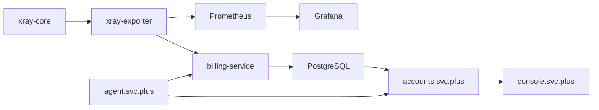

# Cloud Network Billing & Control Plane

## Summary

This platform is a closed-loop network data control plane with strict service
boundaries:

- `xray-core` is the data plane and only exposes raw per-UUID traffic stats.
- `xray-exporter` is the translation layer and only converts Xray stats into
  Prometheus metrics.
- `Prometheus` and `Grafana` are observability only.
- `PostgreSQL` is the billing source of truth.
- `accounts.svc.plus` is the API aggregation layer for users, usage, and billing.
- `console.svc.plus` is the browser surface and never reads DB or Prometheus
  directly.
- `agent.svc.plus` is the control layer for scheduling, reconciliation, and
  future automation hooks.

## Target Data Flow

## Responsibilities

### xray-core

- Only forwards traffic.
- Emits raw uplink/downlink totals per UUID through its stats API.
- Does not know about billing, dashboards, or user aggregation.

### xray-exporter

- Polls Xray stats on a fixed interval.
- Enriches records with `email`, `node_id`, `env`, and `inbound_tag`.
- Exposes Prometheus-format metrics for scraping and dashboarding.
- Maintains a local cache for `uuid -> email` resolution.
- Falls back gracefully when Xray or the backing account lookup is temporarily
  unavailable.

### billing-service

- Consumes exporter snapshots or equivalent minute-level traffic deltas.
- Computes `delta_bytes = current_bytes - last_bytes`.
- Writes idempotent minute rows into PostgreSQL.
- Replays late-arriving minutes and performs reconciliation after restart.
- Never reads Prometheus for the billing truth path.

### accounts.svc.plus

- Reads traffic, quota, policy, and billing data from PostgreSQL only.
- Aggregates `traffic_minute_buckets`, `billing_ledger`, and quota state into
  user-facing API responses.
- Provides the single API surface for `console.svc.plus`.

### console.svc.plus

- Uses `accounts.svc.plus` for account, usage, and billing data.
- Embeds Grafana for observability views.
- Never reads PostgreSQL or Prometheus directly.

### agent.svc.plus

- Orchestrates scheduled jobs and reconciliation loops.
- Executes control actions and future autoscaling hooks.
- Can ingest anomaly signals, but anomaly scoring remains separable from the
  core billing loop.

## Data Contract

Required labels and persisted fields:

- `uuid`
- `email`
- `node_id`
- `env`
- `inbound_tag`

Billing writes are minute-bucketed and idempotent with a composite key of
`uuid + minute_ts + node_id + env`.

## Operational Rules

1. `xray-core` stays pure data plane.
2. `xray-exporter` stays collection and metric translation only.
3. `Prometheus` stays observability only.
4. `PostgreSQL` stays the single source of truth for billing.
5. `accounts` stays the aggregation API.
6. `console` stays the presentation layer.
7. `agent` stays the control layer.

## v1 Implementation Order

1. Lock the exporter metric shape and label contract.
2. Lock minute-level billing writes and reconciliation in PostgreSQL.
3. Keep `accounts` on PostgreSQL-backed usage and billing reads.
4. Keep `console` on accounts-only data access.
5. Wire `agent` to schedule reconciliation and future control actions.

## Success Criteria

- Billing totals can be reconstructed from PostgreSQL alone.
- Grafana can visualize exporter metrics without affecting billing.
- Console usage and billing views continue to work with accounts as the only
  API dependency.
- Agent-controlled reconciliation can recover late or missing minutes without
  changing the service boundary model.
