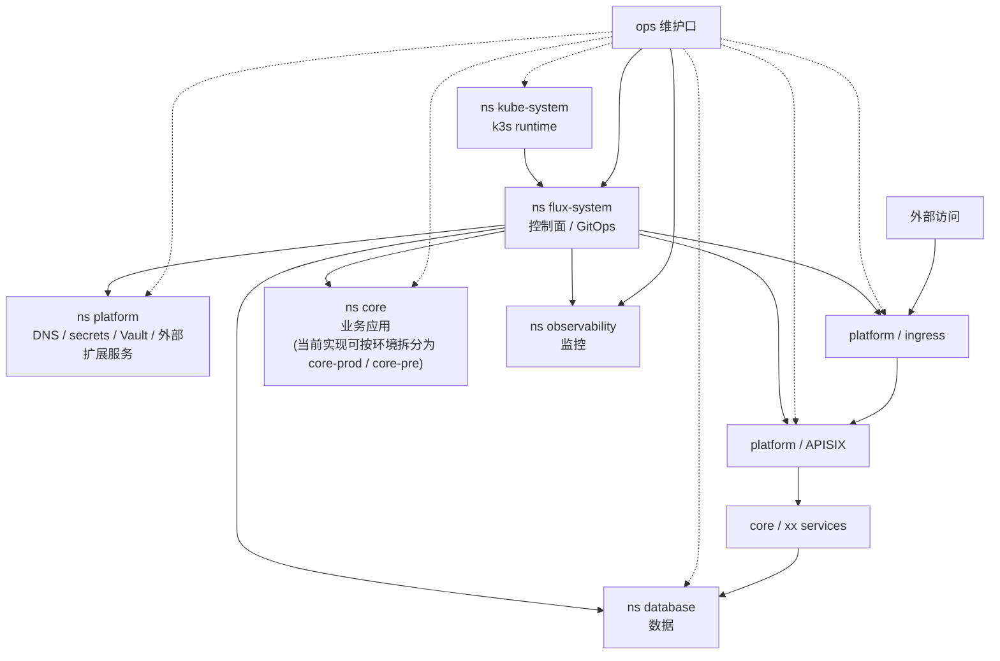

# Project Deploy Overview

This document maps the current deploy topology for the 10 core services and the
desktop build machine pipeline.

The diagram below groups services by the deploy fabric they use:

  - direct service release workflows
  - shared single-node release fabric
  - shared platform / internal services
  - desktop development and parity-release hosts
  - flexible stunnel-distributed VPS placement

For the current k3s migration target, the logical namespace view is simplified
into:

- `kube-system`: k3s runtime
- `flux-system`: GitOps control plane
- `platform`: ingress / DNS / secrets / Vault / external extension services
- `core`: business apps, with current implementation split possible as `core-prod` / `core-pre`
- `database`: data
- `observability`: monitoring

```mermaid
flowchart TB
  classDef gha fill:#1f2937,stroke:#111827,color:#ffffff;
  classDef ansible fill:#0f766e,stroke:#115e59,color:#ffffff;
  classDef runtime fill:#1d4ed8,stroke:#1e40af,color:#ffffff;
  classDef domain fill:#7c3aed,stroke:#5b21b6,color:#ffffff;
  classDef internal fill:#374151,stroke:#111827,color:#ffffff;
  classDef note fill:#f59e0b,stroke:#b45309,color:#111827;

  subgraph GHA["GitHub Actions pipelines"]
    ConsoleWF["service_release_frontend-deploy.yml"]
    DocsWF["service_release-docs-deploy.yml"]
    APIWF["service_release-service-control-plane-deploy.yml"]
    OpenClawWF["openclaw_gateway.yml"]
    AgentWF["service_release_agent_proxy_node.yml"]
    DesktopWF["cloud-dev-desktop.yml + cloud-dev-desktop-parity-release.yml<br/>merged into one pipeline"]
  end

  subgraph ANS["Ansible entrypoints"]
    ConsolePlay["ansible/playbooks/deploy_console_frontend.yml"]
    DocsPlay["ansible/playbooks/deploy_docs_compose.yml"]
    AccountsPlay["ansible/playbooks/deploy_accounts_compose.yml"]
    RagPlay["ansible/playbooks/deploy_rag_server_compose.yml"]
    OpenClawPlay["ansible/playbooks/openclaw_gateway.yml"]
    AgentPlay["ansible/playbooks/deploy_jp_xhttp_contabo.yml"]
    DBPlay["ansible/playbooks/postgresql_migration.yml"]
    LitePlay["ansible/playbooks/deploy_docker_compose_lite_migration.yml"]
  end

  subgraph RUNTIME["Runtime hosts / stacks"]
    Vercel["vercel.com<br/>海外主要前端入口"]
    ConsoleHost["cn-front.svc.plus<br/>47.120.61.35"]
    JPHost["jp-xhttp-contabo.svc.plus<br/>46.250.251.132"]
    USHost["us-xhttp.svc.plus<br/>5.78.45.49"]
    VPSPool["multiple VPS hosts<br/>service placement varies by target"]
    ComposeLite["shared compose-lite stack<br/>caddy + apisix + accounts + rag-server + stunnel-client"]
    OpenClawNode["openclaw gateway runtime<br/>systemd / docker + Caddy + DNS<br/>jp-xhttp-contabo.svc.plus"]
    ProxyNode["agent proxy node<br/>setup-proxy + stunnel + DNS"]
    PostgresNode["postgresql-svc-plus<br/>internal DB runtime"]
    SharedPlatform["shared platform layer<br/>vault / APISIX / stunnel-server / stunnel-client"]
  end

  subgraph DOMAIN["Public / release domains"]
    ConsoleDom["console.svc.plus<br/>vercel.com + cn-front.svc.plus"]
    DocsDom["docs.svc.plus<br/>docs-contabo.svc.plus"]
    VaultDom["vault.svc.plus<br/>vault-contabo.svc.plus"]
    APISIXDom["api.svc.plus<br/>api-contabo.svc.plus"]
    GatewayDom["openclaw-gateway.svc.plus<br/>gateway-contabo.svc.plus"]
    AccountsDom["accounts.svc.plus<br/>accounts-contabo.svc.plus"]
    RagDom["rag-server.svc.plus<br/>rag-server-contabo.svc.plus"]
    PostgresDom["postgresql-contabo.svc.plus"]
    AgentDom["jp-xhttp-contabo.svc.plus"]
    InternalDom["stunnel-server / stunnel-client<br/>internal only"]
  end

  ConsoleWF --> ConsolePlay
  ConsolePlay --> Vercel
  ConsolePlay --> ConsoleHost
  Vercel --> ConsoleDom
  ConsoleHost --> ConsoleDom
  DocsWF --> DocsPlay --> VPSPool --> DocsDom

  APIWF --> AccountsPlay --> VPSPool --> AccountsDom
  APIWF --> RagPlay --> VPSPool --> RagDom
  APIWF --> LitePlay --> VPSPool
  VPSPool --> ComposeLite
  ComposeLite --> APISIXDom
  ComposeLite --> InternalDom

  OpenClawWF --> OpenClawPlay --> VPSPool --> GatewayDom
  AgentWF --> AgentPlay --> VPSPool --> AgentDom
  DBPlay --> PostgresNode --> PostgresDom

  SharedPlatform -.-> VaultDom
  SharedPlatform -.-> APISIXDom
  SharedPlatform -.-> InternalDom
  SharedPlatform -.-> PostgresNode
  SharedPlatform -.-> VPSPool

  DesktopWF --> USHost
  DesktopWF --> JPHost

  ConsoleDom:::domain
  DocsDom:::domain
  VaultDom:::domain
  APISIXDom:::domain
  GatewayDom:::domain
  AccountsDom:::domain
  RagDom:::domain
  PostgresDom:::domain
  AgentDom:::domain
  InternalDom:::internal

  ConsoleWF:::gha
  DocsWF:::gha
  APIWF:::gha
  OpenClawWF:::gha
  AgentWF:::gha
  DesktopWF:::gha

  ConsolePlay:::ansible
  DocsPlay:::ansible
  AccountsPlay:::ansible
  RagPlay:::ansible
  OpenClawPlay:::ansible
  AgentPlay:::ansible
  DBPlay:::ansible
  LitePlay:::ansible

  ConsoleHost:::runtime
  JPHost:::runtime
  USHost:::runtime
  Vercel:::runtime
  VPSPool:::runtime
  ComposeLite:::runtime
  OpenClawNode:::runtime
  ProxyNode:::runtime
  PostgresNode:::runtime
  SharedPlatform:::note
```

## Service Matrix

| Service | Public domain | Release domain | GitHub Actions entrypoint | Ansible playbook | Runtime target | Notes |
| --- | --- | --- | --- | --- | --- | --- |
| `console` | `console.svc.plus` | `console-contabo.svc.plus` | `service_release_frontend-deploy.yml` | `ansible/playbooks/deploy_console_frontend.yml` | `vercel.com` + `cn-front.svc.plus` / `47.120.61.35` | Overseas primary frontend on Vercel, mainland frontend on VPS |
| `docs` | `docs.svc.plus` | `docs-contabo.svc.plus` | `service_release-docs-deploy.yml` -> `service_release-service-control-plane-deploy.yml` | `ansible/playbooks/deploy_docs_compose.yml` | `jp-xhttp-contabo.svc.plus` / `46.250.251.132` | Compose-based docs service |
| `vault` | `vault.svc.plus` | `vault-contabo.svc.plus` | shared platform release plane | n/a in this repo | distributed across VPS targets through stunnel | Treat as shared infra / secret backend |
| `apisix` | `api.svc.plus` | `api-contabo.svc.plus` | shared platform release plane | `ansible/playbooks/deploy_docker_compose_lite_migration.yml` | distributed across VPS targets through stunnel | Edge routing layer |
| `openclaw-gateway` | `openclaw-gateway.svc.plus` | `gateway-contabo.svc.plus` | `openclaw_gateway.yml` | `ansible/playbooks/openclaw_gateway.yml` | `jp-xhttp-contabo.svc.plus` / `46.250.251.132` | Gateway runtime + DNS |
| `accounts` | `accounts.svc.plus` | `accounts-contabo.svc.plus` | `service_release-service-control-plane-deploy.yml` | `ansible/playbooks/deploy_accounts_compose.yml` | distributed across VPS targets through stunnel | Shared stunnel-client + DB |
| `rag-server` | `rag-server.svc.plus` | `rag-server-contabo.svc.plus` | `service_release-service-control-plane-deploy.yml` | `ansible/playbooks/deploy_rag_server_compose.yml` | distributed across VPS targets through stunnel | Shared stunnel-client + DB |
| `postgresql-svc-plus` | n/a | `postgresql-contabo.svc.plus` | shared platform release plane | `ansible/playbooks/postgresql_migration.yml` | distributed across VPS targets through stunnel | Internal DB runtime |
| `agent-svc-plus` | `jp-xhttp-contabo.svc.plus` | `jp-xhttp-contabo.svc.plus` | `service_release_agent_proxy_node.yml` | `ansible/playbooks/deploy_jp_xhttp_contabo.yml` | distributed across VPS targets through stunnel | Internal proxy node |
| `stunnel-server` / `stunnel-client` | internal only | internal only | shared platform release plane | `ansible/playbooks/deploy_docker_compose_lite_migration.yml` | distributed across VPS targets through stunnel | No public domain |

## Notes

- `accounts` and `rag-server` are the clearest examples of the shared release
  fabric: build image, update release DNS, then run Ansible on the target host.
- `vault`, `apisix`, `postgresql-svc-plus`, and `stunnel-*` are grouped as
  platform services because their operational role is to support the app layer.
- The actual VPS placement can change by environment, but the service-to-stunnel
  contract stays stable, so the deploy graph treats them as portable across VPS
  hosts.
- The desktop pipeline is shown as a single merged pipeline so the development
  machine lifecycle is easier to reason about from one place.

## k3s Logical Access Lines

