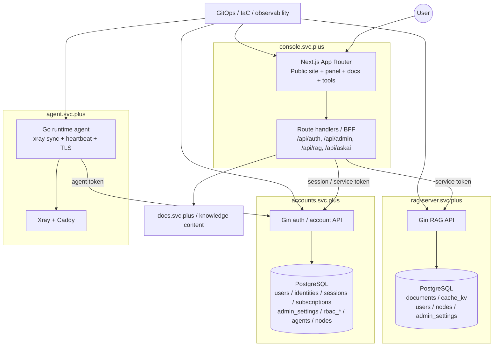

# Cloud-Neutral Toolkit Multi-Repo Control Plane

This repository is the coordination hub for the Cloud-Neutral Toolkit multi-repo project.

## Purpose

- Keep architecture, ownership, standards, and release rhythm in one place.
- Drive cross-repo changes with consistent planning, testing, and rollback.
- Keep Codex working from one workspace context to reduce path and dependency confusion.

## System Overview

## Repository Registry

| Repo | Responsibility | Deploy Address | Local Path | Primary Dependencies |
| --- | --- | --- | --- | --- |
| `console.svc.plus` | Main frontend console (Next.js) | `https://console.svc.plus` | `Cloud-Neutral-Toolkit/console.svc.plus` | `accounts.svc.plus`, `rag-server.svc.plus`, `docs.svc.plus` |
| `accounts.svc.plus` | Identity and auth core (Go) | `https://accounts.svc.plus` | `Cloud-Neutral-Toolkit/accounts.svc.plus` | `postgresql.svc.plus` |
| `rag-server.svc.plus` | RAG backend (Go) | internal / service URL | `Cloud-Neutral-Toolkit/rag-server.svc.plus` | `postgresql.svc.plus`, vector provider |
| `agent.svc.plus` | VM runtime agent and proxy orchestration | `https://agent.svc.plus` | `Cloud-Neutral-Toolkit/agent.svc.plus` | `accounts.svc.plus`, Xray, Caddy |
| `docs.svc.plus` | Docs/content service | `https://docs.svc.plus` | `Cloud-Neutral-Toolkit/docs.svc.plus` | knowledge content |
| `postgresql.svc.plus` | PostgreSQL runtime and bootstrap | internal DB endpoint | `Cloud-Neutral-Toolkit/postgresql.svc.plus` | infra, secrets |
| `observability.svc.plus` | Logs / metrics / tracing | `https://observability.svc.plus` | `cloud-neutral-toolkit/observability.svc.plus` | all services |
| `gitops` + `iac_modules` | Deployment / IaC / environment definitions | N/A | `cloud-neutral-toolkit/gitops`, `cloud-neutral-toolkit/iac_modules` | cloud provider APIs |

## Cross-Repo Docs

- `docs/architecture/web-console/overview.md`
- `subrepos/accounts.svc.plus/docs/architecture/accounts/overview.md`
- `rag-server.svc.plus/docs/architecture/rag-server/overview.md`
- `rag-server.svc.plus/docs/architecture/rag-server/proxy-server/overview.md`

## Codex Operating Model

For every cross-repo request, Codex should return:

1. Change scope: repos + reason
2. Files changed: per repo
3. Risk points: behavior / security / compatibility
4. Test commands: by repo
5. Rollback plan: revert order + data safety

## Suggested Task Intake

- Add `X-Service-Token` validation to console / accounts / rag
- Upgrade Next.js or Go dependencies across one service family
- Align CI cache strategy for all Node or Go repos

Last updated: 2026-03-30
