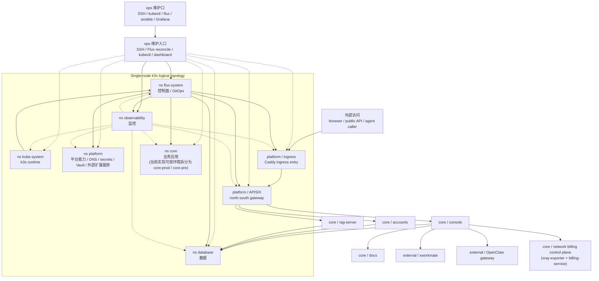

# Cloud-Neutral Toolkit Multi-Repo Control Plane

This repository is the coordination hub for the Cloud-Neutral Toolkit multi-repo project.

## Purpose

- Keep architecture, ownership, standards, and release rhythm in one place.
- Drive cross-repo changes with consistent planning, testing, and rollback.
- Keep Codex working from one workspace context to reduce path and dependency confusion.

## System Overview

## Runtime Topology Notes

- `ns flux-system` 保持独立，承接 GitOps 控制面职责。
- `ns platform` 是统一的平台能力层，文档口径上同时吸收原 `extsvc` 的职责，包括 `Vault` 与其他外部扩展服务。
- `ns core` 是逻辑业务层；当前实现为了环境隔离，仍可拆分为 `core-prod` / `core-pre`。
- `ns database` 与 `ns observability` 保持独立，避免和平台入口层混在一起。
- “外部访问”与“ops 维护口”是两条独立流向：前者按 `外部访问 -> ingress -> APISIX -> 业务服务` 进入，后者面向 SSH、`kubectl`、`flux`、监控与故障处理。
- `console` 的前端路由把 `docs.svc.plus` 和 `xworkmate.svc.plus` 作为独立外挂服务来消费，同时保留 `accounts`、`rag-server` 和外部 OpenClaw gateway 这几条主链路。

## Repository Registry

| Repo | Responsibility | Deploy Address | Local Path | Primary Dependencies |
| --- | --- | --- | --- | --- |
| `console.svc.plus` | Main frontend console (Next.js) | `https://console.svc.plus` | `Cloud-Neutral-Toolkit/console.svc.plus` | `accounts.svc.plus`, `rag-server.svc.plus`, `docs.svc.plus`, `xworkmate.svc.plus`, `openclaw.svc.plus` |
| `accounts.svc.plus` | Identity and auth core (Go) | `https://accounts.svc.plus` | `Cloud-Neutral-Toolkit/accounts.svc.plus` | `postgresql.svc.plus` |
| `rag-server.svc.plus` | RAG backend (Go) | internal / service URL | `Cloud-Neutral-Toolkit/rag-server.svc.plus` | `postgresql.svc.plus`, vector provider |
| `agent.svc.plus` | VM runtime controller, proxy orchestration, and future reconciliation hooks | `https://agent.svc.plus` | `Cloud-Neutral-Toolkit/agent.svc.plus` | `accounts.svc.plus`, Xray, Caddy |
| `docs.svc.plus` | Docs/content service | `https://docs.svc.plus` | `Cloud-Neutral-Toolkit/docs.svc.plus` | knowledge content |
| `postgresql.svc.plus` | PostgreSQL runtime and bootstrap | internal DB endpoint | `Cloud-Neutral-Toolkit/postgresql.svc.plus` | infra, secrets |
| `observability.svc.plus` | Logs / metrics / tracing | `https://observability.svc.plus` | `cloud-neutral-toolkit/observability.svc.plus` | all services |
| `gitops` + `iac_modules` | Deployment / IaC / environment definitions | N/A | `cloud-neutral-toolkit/gitops`, `cloud-neutral-toolkit/iac_modules` | cloud provider APIs |

## Planned Control Plane Components

- `xray-exporter` converts raw Xray stats into Prometheus metrics and enriches them with `uuid`, `email`, `node_id`, `env`, and `inbound_tag`.
- `billing-service` computes minute deltas and writes idempotent billing rows to PostgreSQL.
- These components are part of the control-plane contract even when they live in a separate deployment bundle from the main application repos.

## Cross-Repo Docs

- `docs/architecture/project-deploy-overview.md`
- `docs/architecture/web-console/overview.md`
- `../accounts.svc.plus/docs/architecture/accounts/overview.md`
- `rag-server.svc.plus/docs/architecture/rag-server/overview.md`
- `rag-server.svc.plus/docs/architecture/rag-server/proxy-server/overview.md`

## Codex Operating Model

For every cross-repo request, Codex should return:

1. Change scope: repos + reason
2. Files changed: per repo
3. Risk points: behavior / security / compatibility
4. Test commands: by repo
5. Rollback plan: revert order + data safety

## Suggested Task Intake

- Add `X-Service-Token` validation to console / accounts / rag
- Upgrade Next.js or Go dependencies across one service family
- Align CI cache strategy for all Node or Go repos

Last updated: 2026-03-30
