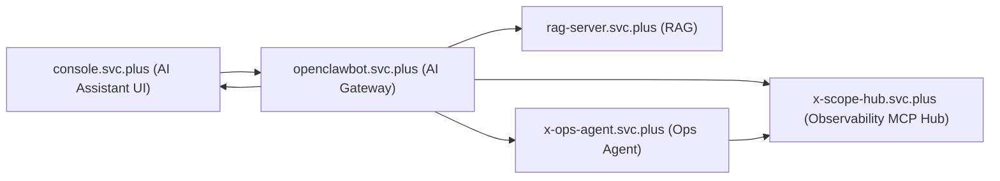
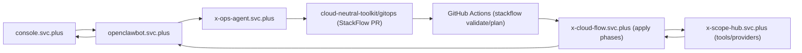
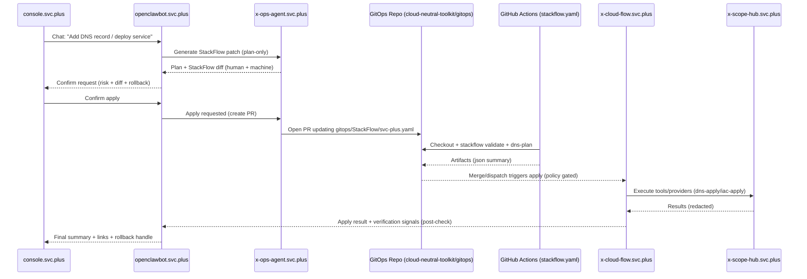

# AI Platform Division & Integration Flow (AI Gateway + RAG + MCP Hub + Ops Agent + GitOps StackFlow)

This document defines the platform-level division of responsibilities and the integration route for (zh-CN, with English service identifiers):

- **AI Gateway**: `openclawbot.svc.plus`
- **RAG**: `rag-server.svc.plus`
- **Observability MCP Hub**: `x-scope-hub.svc.plus`
- **Ops Agent**: `x-ops-agent.svc.plus`
- **GitOps Runner / Flow Executor**: `x-cloud-flow.svc.plus`
- **Frontend AI Assistant UI**: `console.svc.plus`

It is a cross-repo “contract” doc. Repo-specific implementation details live in each repo.

## Objective

规划一套清晰的平台分工与集成链路，覆盖：

- 对话链路（Console UI -> AI Gateway -> RAG/MCP Hub/Ops Agent -> 返回 UI）
- 运维/变更链路（Plan/Confirm/Apply + GitOps StackFlow + 可观测闭环）

Establish a clear platform split and a standard end-to-end flow:

`console.svc.plus (AI Assistant UI)` -> `openclawbot.svc.plus (AI Gateway)` ->

- `rag-server.svc.plus` (knowledge retrieval + citations)
- `x-scope-hub.svc.plus` (observability queries + external MCP tools)
- `x-ops-agent.svc.plus` (ops workflows: diagnose -> plan -> confirm -> apply -> rollback)
- `x-cloud-flow.svc.plus` (GitOps/StackFlow execution: dns/iac/deploy/ansible and other phases)

Then return results to the UI:

`console.svc.plus (results UI)` <- `openclawbot.svc.plus (AI Gateway)`.

## Non-Goals

- Direct UI-to-tool access (UI must never call SSH/Cloud Run/Vercel/Cloudflare tools directly).
- Embedding long-lived privileged secrets in browsers.
- Replacing existing service-to-service auth patterns without an explicit migration plan.

## Guiding Principles (Platform Contract)

- **One entrypoint**: `console.svc.plus` only talks to `openclawbot.svc.plus` for AI execution.
- **GitOps-first for writes**: write changes are proposed as StackFlow diffs and applied via GitOps (auditable and reversible).
- **Separation of concerns**:
  - `rag-server`: retrieval + citations
  - `x-scope-hub`: tools + observability queries (redaction + allowlist)
  - `x-ops-agent`: runbooks/workflows (diagnose -> plan -> verify -> rollback)
  - `x-cloud-flow`: apply phases (dns/iac/deploy) with strict policy gates
- **Plan/Confirm/Apply**: any write-capable action must have explicit confirmation and a rollback plan.

## Component Responsibilities

### 1) console.svc.plus (AI Assistant UI)

**Role**: Presentation layer.

- Renders the chat panel (prompt input + streaming output).
- Displays:
  - assistant text
  - structured “steps/progress”
  - citations (from RAG)
  - tool execution summary + confirmation prompts (when required)
- Never stores or uses privileged tool credentials.

### 2) openclawbot.svc.plus (AI Gateway)

**Role**: The only entrypoint for AI execution. Orchestrator + policy engine.

- Accepts chat requests from console.
- Enforces:
  - authentication + per-tenant RBAC
  - allowlist of tools/operations by environment (dev/sit/prod)
  - rate limits / quotas
  - “plan -> confirm -> apply” safety gates for write actions
- Orchestrates calls to:
  - `rag-server` for retrieval
  - `x-scope-hub` for observability + external MCP tools
  - `x-ops-agent` for higher-level runbooks/workflows
  - `x-cloud-flow` (indirectly) for GitOps execution when confirmed
- Emits:
  - streaming progress events
  - audit logs
  - trace context propagated to downstreams

### 3) rag-server.svc.plus (RAG)

**Role**: Knowledge retrieval with citations.

- Document ingestion + indexing.
- Query endpoint returning:
  - ranked passages
  - citations (doc ids, offsets/urls, confidence)
- Optional: “policy filters” (tenant boundaries, sensitivity labels).

### 4) x-scope-hub.svc.plus (Observability MCP Hub)

**Role**: Tool hub + observability query layer.

- Connects to:
  - internal observability systems (logs/metrics/traces)
  - external MCP servers (e.g., `mcp-ssh-manager`, `cloud-run-mcp-server`, `vercel.com-mcp-server`, `cloudflare-config-mcp-server`)
- Exposes a curated tool catalog to the AI Gateway.
- Enforces:
  - tool-level allowlist
  - timeouts / retries / circuit breakers
  - redaction rules (never return secrets verbatim)
- Provides structured tool results (machine-readable + human summary).

### 5) x-ops-agent.svc.plus (Ops Agent)

**Role**: “Operational reasoning” and workflows (runbooks).

- Encodes runbooks as workflows:
  - diagnose (collect signals)
  - plan (propose actions)
  - confirm (explicit approval requirement)
  - apply (execution, potentially via x-scope-hub tools)
  - verify (post-checks)
  - rollback (when needed)
- The ops agent should prefer x-scope-hub as the execution substrate (for SSH/Cloud Run/Vercel/Cloudflare).

### 6) x-cloud-flow.svc.plus (GitOps Runner / Flow Executor)

**Role**: 变更执行与发布流控制面（面向 GitOps/StackFlow）。

- Treat **StackFlow** as the desired-state spec of “what to change and where”.
- Executes phases such as:
  - dns plan/apply (Cloudflare/Alicloud/etc.)
  - iac plan/apply (Terraform/Ansible/other)
  - deploy/release orchestration (optional)
- Trigger sources:
  - GitHub Actions / CI runner (recommended for plan/validate)
  - Cloud Run Jobs / internal runner (optional for apply, with strict approvals)

## Dialogue Flow (Read/Plan)



## Ops/Change Flow (Confirm-required Apply)



## GitOps / StackFlow Integration (svc-plus.yaml)

关键点：**写操作的默认落地路径应尽量走 GitOps**（StackFlow），而不是直接在对话执行不可追溯的 imperative 修改。

- Source of truth is stored in `cloud-neutral-toolkit/gitops` repo:
  - `gitops/StackFlow/svc-plus.yaml`
- This control repo provides a CI workflow to plan/validate StackFlow configs:
  - `.github/workflows/stackflow.yaml` (workflow name: `StackFlow (GitOps Plan/Validate)`)

### Recommended change lifecycle (Plan -> PR -> Validate -> Apply)



### Verification loop (Observability close-the-loop)

After apply, treat verification as a first-class phase (owned by `x-ops-agent`, executed via `x-scope-hub`):

- **Deploy/Config verification**: expected revision, expected DNS records, expected certificates.
- **Service health**: error rate, latency, saturation, restart loops.
- **User-facing checks**: key endpoints smoke test.
- **Decision (pass)**: mark operation as verified.
- **Decision (fail)**: propose rollback (StackFlow revert or previous revision) and require confirm.

### StackFlow spec (illustrative snippet)

Below is an **illustrative** (non-authoritative) snippet showing how `apiVersion: gitops.svc.plus/v1alpha1` and `kind: StackFlow` is used.
The authoritative config lives in `cloud-neutral-toolkit/gitops:gitops/StackFlow/svc-plus.yaml`.

```yaml
apiVersion: gitops.svc.plus/v1alpha1
kind: StackFlow
metadata:
  name: svc-plus
spec:
  global:
    domain: svc.plus
    environments:
      prod:
        providers:
          cloudflare:
            zone: svc.plus
  targets:
    - id: console
      type: vercel
      domains:
        - console.svc.plus
    - id: openclawbot
      type: cloudrun
      region: asia-east1
      domains:
        - openclawbot.svc.plus
  phases:
    - name: validate
      policy: readonly
    - name: dns-plan
      policy: readonly
    - name: dns-apply
      policy: confirm-required
```

## Execution Modes (Safety Model)

The platform must support at least these modes, enforced in the Gateway:

1. **Read-only**:
   - Observability queries
   - RAG queries
   - Listing resources / generating plans
2. **Plan-only** (default for write-capable domains):
   - Produces “what I will do” steps + exact commands/API calls
3. **Confirm-required apply**:
   - Requires explicit confirmation from a privileged user before any write action.

### Confirm UI contract (minimal)

The Gateway returns a structured confirmation request:

- `operationId`
- `summary`
- `riskLevel` (e.g., low/medium/high)
- `diff/plan` (commands, IaC diff, resources impacted)
- `rollbackPlan`

The UI sends:

- `operationId`
- `confirmed: true`

## API/Contract Sketch (Minimal, Stable)

### A) UI -> Gateway (chat)

- `POST /api/ai/chat` (or a versioned endpoint)
- Request:
  - `tenantId` / `workspaceId`
  - `messages[]`
  - `mode` (read-only / plan-only / apply-with-confirm)
  - `context` (optional: current page, selected project)
- Response:
  - streaming events: `assistant_delta`, `progress`, `citation`, `tool_call`, `tool_result`, `confirm_request`, `final`

### B) Gateway -> RAG

- `POST /v1/query`
- Response returns citations, not just text.

### C) Gateway -> MCP Hub / Ops Agent

Use a single “tool invocation” envelope:

- `toolName`
- `args`
- `trace` fields
- `actor` fields
- `timeoutMs`

## Policy & Permissions (Minimal)

- `openclawbot` is the policy gate:
  - environment allowlists (dev/sit/prod)
  - actor RBAC (who can request apply)
  - confirm-required semantics
- `x-scope-hub` enforces tool-level policy:
  - read-only tools callable from read-only mode
  - write tools callable only from apply phase (preferably initiated by `x-cloud-flow`)

## Observability & Audit Requirements

### Trace context propagation

All hops should propagate at least:

- `x-request-id` (or equivalent)
- W3C traceparent/tracestate (preferred)
- `actor` identity (user id/email/role) as structured log fields (not in plaintext headers if avoidable)

### Audit log schema (minimum)

For any tool execution:

- `request_id`
- `actor`
- `tool_name`
- `operation_id`
- `environment` (dev/sit/prod)
- `result` (success/failure)
- `redacted_args_summary`
- `redacted_output_summary`

## Secrets & Env Governance (Required)

Follow `skills/env-secrets-governance/SKILL.md`:

- `.env.example` contains keys only, no values.
- Prod/SIT secrets live in Secret Manager / platform env.
- Never return secrets in tool results; redact by default.

## Rollout Plan (Recommended)

1. **MVP (Read-only)**
   - console chat -> gateway -> rag + observability queries
   - tool allowlist: read-only only
2. **Plan-only Ops**
   - gateway -> ops-agent produces “exact commands” but does not execute
3. **Confirm-required Apply**
   - execution enabled for a small allowlist of tools (start with safe domains)
   - enforce rollback plan field as mandatory

## Open Questions

- Ownership: who creates PRs into `cloud-neutral-toolkit/gitops` (gateway vs ops-agent)?
- Apply executor: GitHub Actions vs `x-cloud-flow` Cloud Run Job. If Cloud Run Job, what is the approval/auth mechanism?
- Tool allowlist boundaries:
  - which tools must only be callable by `x-cloud-flow` (apply phases)
  - which tools can be invoked in read-only by `x-scope-hub`
- Console -> Gateway auth: session cookie vs bearer token?
- Tenant boundaries:
  - does RAG index per-tenant or shared with labels?
  - does observability query scope by tenant/project?
- Confirmation UX: does confirm UI live in console or gateway?
- Prod v1: minimum set of write tools allowed?
