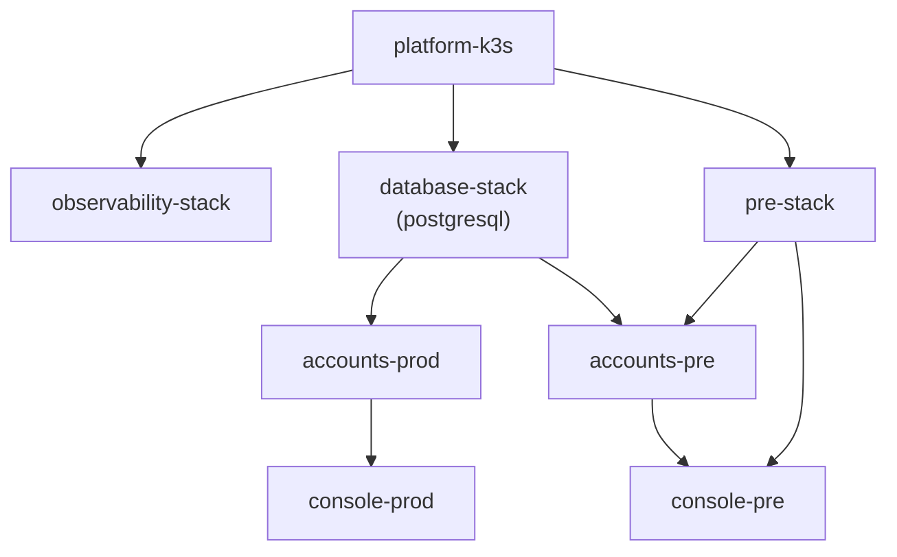
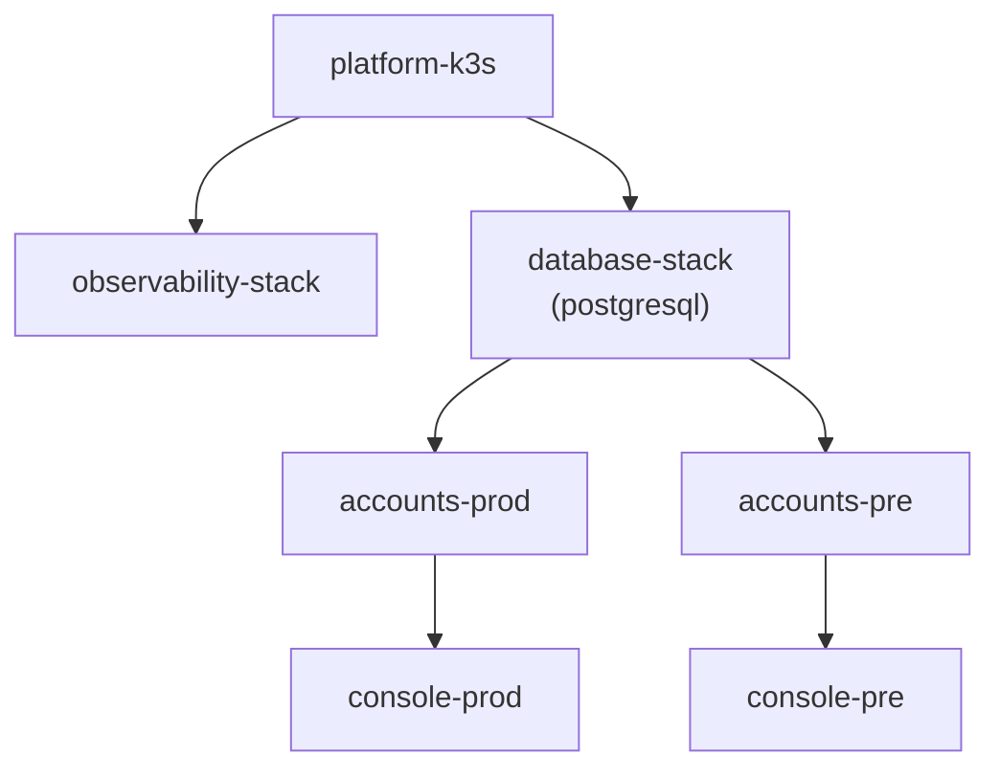

# Cross-Repo Task Board

Use this board to track multi-repo initiatives.

## 1) Active Backlog

| ID | Priority | Objective | Impacted Repos | Owner | Status |
| --- | --- | --- | --- | --- | --- |
| CRT-001 | P0 | Internal service auth consistency | `console`, `accounts`, `rag`, `page-reading-agent-backend` | `@shenlan` | PLANNED |
| CRT-002 | P1 | Shared CI cache optimization | `console`, `page-reading-agent-dashboard`, `page-reading-agent-backend` | `@tbd` | TODO |
| CRT-003 | P1 | Release metadata standardization | all deployable repos | `@tbd` | TODO |
| CRT-004 | P0 | Accounts + Console RBAC / 多租户 / Token model convergence | `console`, `accounts`, control repo | `@shenlan` | IN_PROGRESS |
| CRT-005 | P0 | Externalize docs/blog delivery via `docs.svc.plus` + `docs-agent` | `docs.svc.plus`, `console.svc.plus`, `knowledge`, `openclaw.svc.plus`, control repo | `@shenlan` | IN_PROGRESS |
| CRT-006 | P1 | Shared `app-service` Helm contract for core / extsvc workloads | `artifacts`, `gitops`, `console.svc.plus`, `accounts.svc.plus`, `rag-server.svc.plus`, `docs.svc.plus`, `x-cloud-flow.svc.plus`, `x-ops-agent.svc.plus`, `x-scope-hub.svc.plus`, `postgresql.svc.plus` | `@shenlan` | PLANNED |
| CRT-007 | P0 | Cloud Network Billing & Control Plane v1 | `agent.svc.plus`, `accounts.svc.plus`, `console.svc.plus`, `observability.svc.plus`, control repo | `@shenlan` | IN_PROGRESS |

## 2.1) GitOps Dependency Maps

Use these two views to reason about cluster rollout order before changing `dependsOn`.

### Current State

This is the legacy dependency shape that caused `pre-stack` to wait on the heavier infrastructure gate:



### Target State

This is the intended business rollout chain for the core services after the GitOps dependency cleanup:



### Why this order

- `platform-k3s` is the cluster foundation, so platform and infra stacks must wait for it.
- `observability-stack` is a platform concern and only needs the cluster foundation.
- `database-stack` provides shared runtime services such as PostgreSQL, so core business services should wait for it.
- `accounts` is the auth and account core for both `pre` and `prod`.
- `console` depends on `accounts`, so it should reconcile only after the auth layer is ready.
- Keeping the chain explicit prevents unrelated infrastructure health from blocking business rollout in surprising ways.

## 3) CRT-001 Execution Plan (Real Task)

**Objective**
- Standardize internal service auth (`X-Service-Token`) behavior and error handling across the core service chain.

**Impacted repos**
- `console.svc.plus`
- `accounts.svc.plus`
- `rag-server.svc.plus`
- `page-reading-agent-backend`

**Phase plan**
- **Phase 1 (design freeze):** align header contract, middleware behavior, and error format (`401`/`403`).
- **Phase 2 (implementation):** apply auth checks in each repo with shared naming and consistent logs.
- **Phase 3 (verification):** run unit + integration + service-chain smoke tests.
- **Phase 4 (release):** deploy in checklist order from backend dependencies to frontend callers.

**Target files (expected)**
- `console.svc.plus`: API proxy routes and internal auth helper.
- `accounts.svc.plus`: middleware/auth validation and internal health endpoint behavior.
- `rag-server.svc.plus`: middleware/auth validation and internal route guards.
- `page-reading-agent-backend`: middleware and route-level guard integration.

**Risk points**
- Token mismatch across environments (`.env` vs cloud secret manager).
- Mixed status codes breaking frontend retry/error handling.
- Hidden bypass route missing middleware attachment.

**Test commands (baseline)**
- `console.svc.plus`: `yarn lint && yarn test`
- `accounts.svc.plus`: `go test ./...`
- `rag-server.svc.plus`: `go test ./...`
- `page-reading-agent-backend`: `yarn test` (or repo test command)
- Control repo chain check: `bash test/e2e/service-auth-integration-test.sh`

**Rollback plan**
- Revert in reverse dependency order: callers first, then backend services.
- Keep old token value available until all services are rolled back.
- If partial failure happens, disable only newly added strict routes first.

## 4) Request Template (for Codex)

Copy this when creating a new multi-repo change request:

```md
Objective:
Impacted repos:
Constraints:
Acceptance criteria:
Target environment:
Validation mode:
Gate entry:
```

## 4.1) CRT-004 Execution Plan (Real Task)

**Objective**
- Align `accounts.svc.plus` and `console.svc.plus` on a real tenant-aware RBAC and token ownership model.

**Impacted repos**
- `accounts.svc.plus`
- `console.svc.plus`
- `github-org-cloud-neutral-toolkit`

**Phase plan**
- **P0:** replace legacy `public_token` flow with one-time `exchange_code`, unify console permission gates, define platform-level public token visibility.
- **P1:** align session contract with real backend data model, add integration registry and token ownership matrix.
- **P2:** introduce tenant membership and tenant-scoped RBAC in `accounts`, switch console to tenant-aware access control.
- **P3:** support shared mode and dedicated mode component authorization, credential ownership, and audit trails.

**Key design defaults**
- Platform tokens are visible only to `root / platform_admin` by default.
- `INTERNAL_SERVICE_TOKEN` remains platform-internal and must not represent end-user identity.
- Tenant authorization is evaluated before component-level authorization.
- `console` BFF routes must not rely on role-only checks when a permission gate exists.

**Primary deliverables**
- Security audit:
  - `docs/security/accounts-console-rbac-multitenancy-audit-2026-03-17.md`
- Target architecture:
  - `docs/architecture/accounts-console-tenant-rbac-target-architecture.md`
- Follow-on implementation backlog:
  - this section (`CRT-004`)

**Risk points**
- False multi-tenant semantics in frontend session payload without backend tenant ownership.
- Tenant-free session and shared token boundaries still exist even after the legacy `public_token` flow was removed.
- Shared integration tokens without explicit owner/scope/visibility governance.
- Console admin BFF routes drifting away from backend permission semantics.

**Verification baseline**
- `accounts.svc.plus`: schema, auth middleware, token exchange, admin permission gates
- `console.svc.plus`: session normalization, access control utilities, admin BFF route guards, integration token resolvers
- Control repo: audit/architecture docs and backlog stay decision-complete

## 4.2) Stable Release Gate Template (required output)

Use this template when asking Codex to verify a stable release candidate:

```md
Mode:
Service:
Track:
Service ref:
Smoke URL:
Expected status:
Required evidence:
```

**Mode defaults**
- `local`: repo-local config/doc validation only
- `stable`: repo-local validation plus live smoke against the stable domain
- Gate entry: `.github/workflows/stable_release_gate.yml`

## 5) Delivery Template (required output)

Codex should answer with:

```md
## Change Scope
## Files Changed
## Risk Points
## Test Commands
## Rollback Plan
```

## 5.1) CRT-005 Execution Plan (Real Task)

**Objective**
- Move `/docs` and `/blogs` content delivery out of `console.svc.plus` build-time sync and into `docs.svc.plus`, then expose document retrieval and controlled updates as `docs-agent` behind the OpenClaw gateway.

**Impacted repos**
- `docs.svc.plus`
- `console.svc.plus`
- `knowledge`
- `openclaw.svc.plus`
- `github-org-cloud-neutral-toolkit`

**Phase plan**
- **Phase 1:** ship read-only docs/blog service APIs and reload flow in `docs.svc.plus`
- **Phase 2:** switch `console.svc.plus` `/docs`, `/blogs`, sitemap, and latest blogs feed to the new service
- **Phase 3:** register `docs-agent` in gateway as read-only
- **Phase 4:** enable `docs.plan_update`
- **Phase 5:** enable confirm-required `docs.apply_update`

**Key defaults**
- `knowledge` is the single source of truth
- browser traffic does not call `docs.svc.plus` directly
- all `/api/v1/*` reads require `X-Service-Token`
- `docs-agent` writes are restricted to `knowledge/docs/**` and `knowledge/content/**`

**Risk points**
- UI regression if remote HTML differs from current markdown rendering
- reload or pull failures can desync source and index snapshots
- unsafe path handling in `docs-agent` would be release-blocking
- gateway policy drift could allow apply without confirmation

## 5.2) CRT-006 Execution Plan (Real Task)

**Objective**
- Converge the core, extsvc, and database workloads on the shared `app-service` Helm contract, while keeping `stunnel-client` separate and `postgresql` server-side stunnel inline.

**Impacted repos**
- `artifacts`
- `gitops`
- `console.svc.plus`
- `accounts.svc.plus`
- `rag-server.svc.plus`
- `docs.svc.plus`
- `x-cloud-flow.svc.plus`
- `x-ops-agent.svc.plus`
- `x-scope-hub.svc.plus`
- `postgresql.svc.plus`
- `github-org-cloud-neutral-toolkit`

**Phase plan**
- **Phase 1 (contract freeze):** add the pod-spec hooks required by `rag-server` and `docs` to the reusable chart, and lock down probe defaults for `console`.
- **Phase 2 (implementation):** update service overlays to use the shared chart contract, with `rag-server` config mounts and `docs` knowledge-repo mounts modeled explicitly.
- **Phase 3 (special cases):** keep `stunnel-client` as a separate chart, preserve inline `stunnel-server` in `postgresql`, and treat `x-scope-hub` as a single selected runtime component rather than a multi-container pod.
- **Phase 4 (verification):** run chart lint/template checks plus namespace `kustomize build` for `core-prod`, `core-pre`, and `extsvc`.
- **Phase 5 (publish / rollout):** bump chart consumers in GitOps only after the chart package and image release contracts are aligned.

**Risk points**
- `docs.svc.plus` will fail if the knowledge checkout is not mounted or synced at runtime.
- `rag-server.svc.plus` will fail if its config file is not mounted and `CONFIG_PATH` is not set consistently.
- `console.svc.plus` health probing on `/healthz` is unsafe until the probe path is changed to `/`.
- `x-scope-hub.svc.plus` has multiple internal runtimes, so the shared chart must pick a single deployable entrypoint.
- `stunnel-client` ownership must stay separate from the PostgreSQL pod to avoid reintroducing hidden coupling.

**Test commands (baseline)**
- `cd /Users/shenlan/workspaces/cloud-neutral-toolkit/artifacts/oci/charts && helm lint ./apps/app-service`
- `cd /Users/shenlan/workspaces/cloud-neutral-toolkit/artifacts/oci/charts && helm template console-prod ./apps/app-service -f /Users/shenlan/workspaces/cloud-neutral-toolkit/gitops/infra/apps/core/console/base/values.yaml -f /Users/shenlan/workspaces/cloud-neutral-toolkit/gitops/infra/apps/core/console/prod/values.yaml`
- `cd /Users/shenlan/workspaces/cloud-neutral-toolkit/gitops && kustomize build apps/clusters/prod`
- `cd /Users/shenlan/workspaces/cloud-neutral-toolkit/gitops && kustomize build apps/clusters/pre`

**Rollback plan**
- Roll back GitOps overlays first, then revert the shared chart contract, then restore any service-specific probe or mount overrides.
- Keep `stunnel-client` and `stunnel-server` rollback steps separate so the database path can be restored independently of app workloads.

## 5.3) CRT-007 Execution Plan (Real Task)

**Objective**
- Establish the v1 network billing control plane with PostgreSQL as the single source of truth and Grafana/Prometheus as observability only.

**Impacted repos**
- `agent.svc.plus`
- `accounts.svc.plus`
- `console.svc.plus`
- `observability.svc.plus`
- `github-org-cloud-neutral-toolkit`

**Execution checklist**

| Phase | Goal | Deliverables | Test commands | Exit criteria |
| --- | --- | --- | --- | --- |
| `P0` | Freeze billing and observability contracts before implementation | - `docs/architecture/network-data-control-plane.md` remains the system boundary overview<br>- `docs/architecture/network-billing-contracts.md` defines the minimal `xray-exporter` and `billing-service` interfaces plus PostgreSQL schema draft<br>- `docs/testing/network-billing-control-plane-test-matrix.md` defines the shared verification matrix | - `cd /Users/shenlan/workspaces/cloud-neutral-toolkit/github-org-cloud-neutral-toolkit && rg -n "uuid|email|node_id|env|inbound_tag|minute_ts|sourceOfTruth|billing-service|xray-exporter" docs/architecture docs/testing` | - Label contract is documented once and referenced consistently<br>- Billing path and observability path are separated in writing<br>- PostgreSQL is documented as the only billing source of truth |
| `P1` | Keep control responsibilities narrow and orchestration-only in `agent.svc.plus` | - `agent.svc.plus` docs and backlog items describe agent as scheduler / reconciler / future autoscaling executor only<br>- anomaly handling is documented as a separable signal, not a billing dependency<br>- `CRT-007` tracks `xray-exporter` and `billing-service` as separate control-plane components | - `cd /Users/shenlan/workspaces/cloud-neutral-toolkit/github-org-cloud-neutral-toolkit && rg -n "orchestration|reconciliation|autoscaling|anomaly" docs/architecture/network-data-control-plane.md docs/operations-governance/cross-repo-tasks.md` | - Agent docs do not claim billing truth ownership<br>- No implementation task couples anomaly detection to the core billing loop |
| `P2` | Lock `accounts.svc.plus` to PostgreSQL-backed usage and billing only | - `accounts.svc.plus` regression tests assert `/api/account/usage/summary`, `/api/account/usage/buckets`, and `/api/account/billing/summary` return `sourceOfTruth = postgresql`<br>- billing summary test fixture covers ledger rows and quota snapshot from the store layer | - `cd /Users/shenlan/workspaces/cloud-neutral-toolkit/accounts.svc.plus && go test ./api/...` | - Usage and billing APIs expose PostgreSQL truth metadata<br>- Tests fail if source-of-truth metadata disappears or endpoint shape drifts |
| `P3` | Lock `console.svc.plus` to `accounts` for usage/billing reads and Grafana for visibility only | - fetch-layer tests keep `/api/account/usage/summary` as the authoritative read path<br>- UI regression test for `SubscriptionPanel` verifies the accounts-only wording and `sourceOfTruth = postgresql` rendering<br>- Grafana remains an embed path, not a billing data fetch path | - `cd /Users/shenlan/workspaces/cloud-neutral-toolkit/console.svc.plus && yarn test:unit src/modules/extensions/builtin/user-center/lib/fetchAccountUsage.test.ts src/modules/extensions/builtin/user-center/account/__tests__/SubscriptionPanel.test.tsx` | - Console renders accounts-backed source-of-truth metadata<br>- No new console usage/billing path reads Prometheus directly |
| `P4` | Make cross-repo validation executable and replay-safe | - the shared test matrix covers contract, integration, replay, restart recovery, multi-node, multi-env, and failure-mode tests<br>- `CRT-007` includes copy-paste commands for repo-local verification and rollout gates | - `cd /Users/shenlan/workspaces/cloud-neutral-toolkit/github-org-cloud-neutral-toolkit && rg -n "negative delta|duplicate minute|late-arriving|multi-node|multi-env|PostgreSQL unavailable|Xray unavailable" docs/testing/network-billing-control-plane-test-matrix.md docs/operations-governance/cross-repo-tasks.md` | - Teams can validate v1 with a single checklist<br>- Failure-mode coverage is written down before feature expansion |

**Key design defaults**
- `xray-core` emits raw stats only.
- `xray-exporter` enriches and emits metrics only.
- `Prometheus` and `Grafana` are not billing sources.
- `billing-service` writes idempotent minute rows into PostgreSQL.
- `agent` may schedule reconciliation and future autoscaling hooks, but does not own billing truth.

**Risk points**
- Metric label drift between exporter and billing pipeline.
- Negative deltas if Xray stats reset without reconciliation.
- Frontend regressions if console tries to read metrics directly instead of accounts.
- Observability dashboards being misused as billing truth.

**Verification baseline**
- `agent.svc.plus`: proxy/runtime docs and control-boundary docs align with orchestrator-only scope
- `accounts.svc.plus`: usage and billing API responses expose PostgreSQL source-of-truth metadata
- `console.svc.plus`: subscription panel reads source-of-truth metadata from accounts and renders it
- `observability.svc.plus`: dashboards remain presentation-only and do not become billing dependencies

**Detailed execution order**
1. Freeze the billing and metrics contract in documentation before any exporter or billing implementation work starts.
2. Keep `agent.svc.plus` scoped to scheduling, reconciliation, and future execution hooks only.
3. Add source-of-truth-only regression tests in `accounts.svc.plus` so PostgreSQL-backed usage and billing responses are locked.
4. Add source-of-truth-only regression tests in `console.svc.plus` so usage and billing UI continues to read through `accounts`.
5. Initialize the standalone `xray-exporter` repo and implement the snapshot + metrics minimum contract.
6. Initialize the standalone `billing-service` repo and implement minute delta, checkpoint, ledger, and quota-state writes against the existing `accounts.svc.plus` schema.
7. Add an `agent.svc.plus` reconciliation acceptance document that treats billing collection and reconciliation as orchestrated jobs only.
8. Use the shared test matrix as the release gate for multi-node, replay, restart-recovery, and failure-mode validation.
