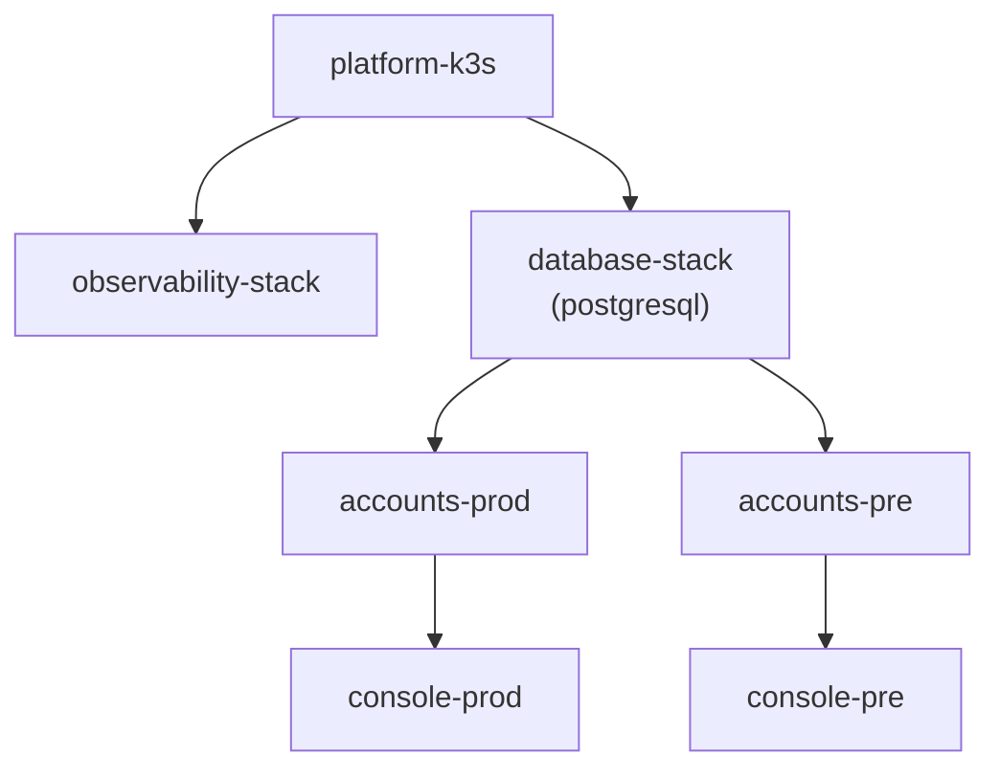

# Multi-Repo Governance Standard

## 0) Branch Roles

- `main`: preview environment branch (fast iteration; merges normally)
- `release/*`: production release lines (protected; updates are "cherry-pick only" as a process rule)

See: `docs/operations-governance/release-branch-policy.md`

## 1) Branching Convention

- Feature: `codex/feat/<topic>`
- Fix: `codex/fix/<topic>`
- Chore: `codex/chore/<topic>`
- Release prep: `codex/release/<topic>`

## 2) Commit Convention

Use Conventional Commits:

- `feat(scope): ...`
- `fix(scope): ...`
- `refactor(scope): ...`
- `chore(scope): ...`
- `docs(scope): ...`

Examples:

- `feat(auth): support internal service token rotation`
- `fix(console): keep API proxy auth header on retry`

## 3) Pull Request Standard

Every PR must include:

- Objective and impacted repos
- Files changed summary
- Risk assessment
- Test commands and results
- Rollback notes

Use the default template in `.github/pull_request_template.md`.

## 4) Version Strategy

- SemVer for each repo: `MAJOR.MINOR.PATCH`
- Bump rules:
  - MAJOR: breaking API/protocol/auth contract changes
  - MINOR: backward-compatible features
  - PATCH: backward-compatible bug fixes
- Release tag format: `<repo>-vX.Y.Z`

## 5) Release Flow

1. Freeze impacted repos for release scope.
2. Verify CI and dependency compatibility.
3. Release in dependency order (see `docs/operations-governance/release-checklist.md`).
4. Run smoke/integration checks across impacted service chain.
5. Announce release + known limitations + rollback entrypoint.

## 5.1) Image Tag and Pull Policy Convention

This repository uses branch-based image promotion as the default operational contract.

- `main`
  - CI publishes the rolling `latest` image tag.
  - GitOps preview environments consume `latest`.
  - `imagePullPolicy` must be `Always` for preview workloads that track `latest`.
- `pre`
  - Uses `latest` as the default image tag.
  - Uses `Always` to force new pulls on each reconcile or restart.
- `release/*`
  - CI publishes release artifacts using a stable release tag or an explicit version tag.
  - GitOps production environments consume the release tag, not `latest`.
- `prd`
  - Uses the release tag or explicit version tag selected for production.
  - `imagePullPolicy` must be `IfNotPresent` unless a repo-specific exception is documented.

Precedence rules:

1. Explicit chart-level `image.tag` or `image.pullPolicy`
2. Environment-level `global.tag` or `global.imagePullPolicy`
3. Chart defaults

Exceptions must be documented in the affected repo's release notes and reflected in the release checklist.

## 5.2) GitOps Dependency Graph

GitOps resources should follow the platform-first dependency order below:

Why this direction:

- `platform-k3s` is the shared cluster foundation, so it must come up before any other app or stack.
- `observability-stack` is a platform concern and only needs the cluster foundation.
- `database-stack` provides shared runtime dependencies such as PostgreSQL, so business services must wait for it.
- `accounts` is the core auth/service layer for both `pre` and `prod`.
- `console` sits on top of `accounts`, so it should only reconcile after auth is ready.
- Keeping the chain explicit reduces surprise failures and avoids coupling business rollout to unrelated infrastructure health checks.

## 6) Environment Variable and Secret Rule

- Local development must use `.env` (gitignored).
- Team baseline template must be `.env.example` (keys only, no values).
- Production/staging must use Secret Manager or platform environment variables.
- Never commit real secrets/tokens/passwords/private keys to Git.
- Any PR that adds a new env var must update `.env.example` and release checklist notes.

## 7) Inheritance Rule

- This governance file is global default.
- Repo-local docs can extend it but must not conflict on safety gates.

## 8) GitHub Actions YAML Rule

- Workflow YAML must stay orchestration-only.
- Non-trivial step logic must move to checked-in scripts and templates.
- See `docs/operations-governance/github-actions-yaml-governance.md`
- Use `skills/github-actions-yaml-governance/SKILL.md` when designing or refactoring control-plane workflows.

## 9) Shareable Skill Package Rule

- Reusable cross-repo skills must live under `skills/<skill-name>/`.
- A distributable ClawHub-style package must be buildable with:
  - `python3 scripts/skills/package_skill.py skills/<skill-name> dist/skills`
- `SKILL.md` frontmatter must stay compatible with the minimal validator in `scripts/skills/validate_skill.py`.
- Package only the skill directory and its bundled resources; do not rely on external local paths for distribution.
