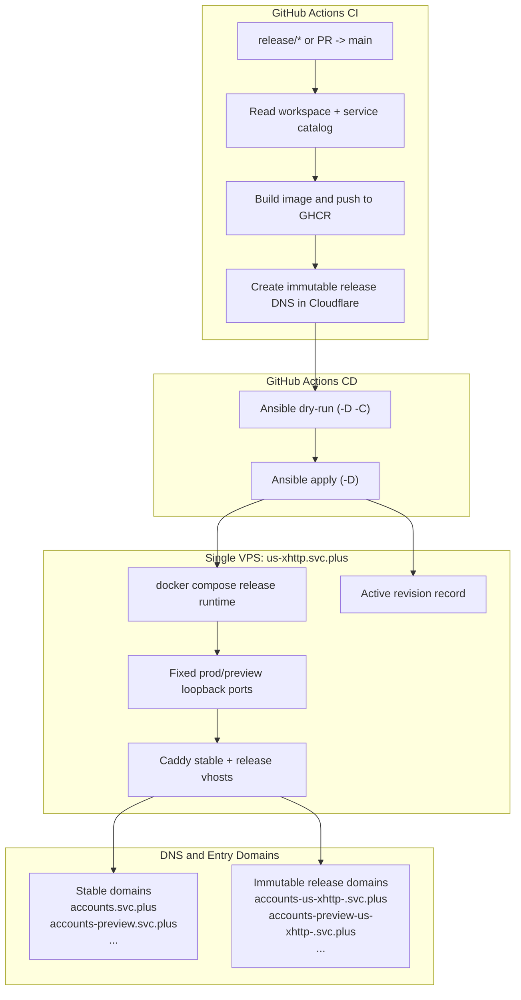

# Single-Node Cloud Run-Like Release Design v1

Date: `2026-03-16`

## Objective

Build the first minimal Cloud Run-like release system for the `svc.plus` services on the single VPS `us-xhttp.svc.plus (5.78.45.49)`.

Design rules:

- Use `GitHub Actions + Ansible + docker compose`
- Treat compose mode as the container execution layer for this first version
- Generate one immutable release domain per deployment
- Keep stable prod/preview domains fixed
- Keep prod/preview ports fixed on the VPS
- Record the active revision in the control plane and on the host
- Run image build and release-DNS creation in the CI phase
- Run host update and Caddy/runtime refresh in the CD phase

Release domain format:

- `<release-prefix>-<deploy-hostname>-<git-short-commit>.<domain>`

Examples:

- `accounts-us-xhttp-d5009762.svc.plus`
- `accounts-preview-us-xhttp-d5009762.svc.plus`

## Sources Of Truth

The first version intentionally uses four checked-in control-plane sources:

1. `console.svc.plus.code-workspace`
   - Source for the list of related repositories
2. `config/single-node-release/repositories.json`
   - Repository classification and release eligibility
3. `config/single-node-release/services/common.yaml` and `config/single-node-release/services/<track>-<service>.yaml`
   - Service release catalog, tracks, domains, ports, Dockerfile paths, and secret names
4. `.github/workflows/service_release_apiserver-deploy.yml`
   - The control-plane workflow entrypoint for manual and reusable execution

This avoids hardcoding service metadata in shell case statements.

Ownership boundary:

- the control repo owns the catalogs, workflow, governance, and release orchestration
- each sub repo still owns its Dockerfile, Ansible playbook, env shape, and service bootstrap logic

## Repository Categories

The current workspace-first repository classification is:

| Category | Repositories |
| --- | --- |
| frontend | `console.svc.plus`, `page-reading-agent-dashboard` |
| api | `accounts.svc.plus`, `rag-server.svc.plus`, `page-reading-agent-backend`, `agent.svc.plus`, `openclaw.svc.plus`, `x-cloud-flow.svc.plus`, `x-ops-agent.svc.plus`, `x-scope-hub.svc.plus` |
| db-runtime | `postgresql.svc.plus`, `observability.svc.plus` |
| docs | `knowledge` |
| control-plane | `github-org-cloud-neutral-toolkit`, `gitops`, `iac_modules` |
| runtime-client | `xstream.svc.plus`, `MemOS` |
| examples | `openclaw-deploy-example` |

The first release-enabled service set remains:

- `accounts`
- `rag-server`
- `x-cloud-flow`
- `x-ops-agent`
- `x-scope-hub`

## Architecture

## Release Model

### Track Rules

| Track | Trigger | Stable Domain | Port Model |
| --- | --- | --- | --- |
| prod | push to `release/*` | `<service>.svc.plus` | fixed prod port |
| preview | PR targeting `main` | `<service>-preview.svc.plus` or service-specific preview domain | fixed preview port |

### Revision Rules

Every deployment creates one release identity:

| Field | Example |
| --- | --- |
| service | `accounts` |
| track | `prod` |
| git short commit | `d5009762` |
| release prefix | `accounts` |
| release domain | `accounts-us-xhttp-d5009762.svc.plus` |
| image ref | `ghcr.io/cloud-neutral-toolkit/accounts:d5009762` |
| stable domain | `accounts.svc.plus` |
| host port | `18080` |

### Runtime Behavior

For v1, the system keeps exactly one active container set per service track.

That means:

- the new release domain is unique per deployment
- the active release domain is reachable after deployment
- older release directories and Caddy files for the same track may be cleaned up
- the design is Cloud Run-like in naming and promotion semantics, not in multi-revision retention

## Secret-ENV And ENV Plan

### Secret-ENV

Use GitHub Actions Secrets or org-level secrets only. Do not store these in the repository.

| Name | Purpose | Scope |
| --- | --- | --- |
| `CLOUDFLARE_DNS_API_TOKEN` | Create/update immutable release DNS records | control repo workflow |
| `GHCR_TOKEN` | Push images to `ghcr.io` | control repo workflow |
| `WORKSPACE_REPO_TOKEN` | Checkout sibling private repos if `GITHUB_TOKEN` is insufficient | control repo workflow |
| `SINGLE_NODE_VPS_SSH_PRIVATE_KEY` | SSH access for Ansible CD stages | control repo workflow |
| `ACCOUNTS_ANSIBLE_VARS_YAML` | Secret env/config for `accounts` | service runtime |
| `RAG_SERVER_ANSIBLE_VARS_YAML` | Secret env/config for `rag-server` | service runtime |
| `X_CLOUD_FLOW_ANSIBLE_VARS_YAML` | Secret env/config for `x-cloud-flow` | service runtime |
| `X_OPS_AGENT_ANSIBLE_VARS_YAML` | Secret env/config for `x-ops-agent` | service runtime |
| `X_SCOPE_HUB_ANSIBLE_VARS_YAML` | Secret env/config for `x-scope-hub` | service runtime |

Decision:

- prefer a scoped Cloudflare API token instead of a legacy global API key
- keep repo URLs and service metadata in checked-in catalog files, not in GitHub Secrets

### ENV

Use repository defaults, workflow `env`, GitHub Variables, or checked-in catalog files for non-sensitive values.

| Name | Source | Purpose |
| --- | --- | --- |
| `GHCR_REGISTRY=ghcr.io` | workflow env | free image registry target |
| `SERVICE_REPO_OWNER=cloud-neutral-toolkit` | workflow env | GitHub org owner |
| `SINGLE_NODE_VPS_SSH_HOST` | GitHub Variable | target host IP |
| `SINGLE_NODE_VPS_SSH_USER` | GitHub Variable | SSH user |
| `SINGLE_NODE_VPS_SSH_PORT` | GitHub Variable | SSH port |
| `SINGLE_NODE_VPS_SSH_KNOWN_HOSTS` | GitHub Variable | strict host verification |
| `domain=svc.plus` | `services/common.yaml` | DNS suffix |
| `repo_url` | `repositories.json` and `services/common.yaml` | source repo URL |
| `stable_domain` | `services/<track>-<service>.yaml` | fixed prod/preview entry domain |
| `release_prefix` | `services/<track>-<service>.yaml` | immutable release domain prefix |
| `host_port` | `services/<track>-<service>.yaml` | fixed track port on the VPS |

## CI And CD Split

### CI Phase

Runs inside GitHub Actions:

1. Resolve repo metadata from workspace + catalogs
2. Checkout the service repo
3. Build the image
4. Push the image to `ghcr.io`
5. Create or update the immutable release DNS record in Cloudflare

### CD Phase

Runs inside GitHub Actions by driving Ansible against `us-xhttp.svc.plus`:

1. Prepare SSH access
2. Materialize service secret vars and runtime vars
3. Run `ansible-playbook -D -C`
4. Run `ansible-playbook -D`
5. Refresh the release Caddy file and the stable domain Caddy file
6. Validate loopback health and release-domain health

## Workflow Shape

The control workflow supports both:

- `workflow_dispatch`
- `workflow_call`

Required runtime inputs:

- `service`
- `track`
- `service_ref`
- `run_apply`

This lets service repos later add thin wrappers:

- `prod-track.yml` for `push` to `release/*`
- `preview-track.yml` for PRs targeting `main`

## Delivery Plan

### Phase 1

Deliver in the control repo:

- workspace-backed repo catalog
- service catalog
- track-aware metadata resolver
- updated `service_release_apiserver-deploy.yml`
- updated workflow and README documentation

### Phase 2

Deliver in each service repo:

- thin wrapper workflows that call the control workflow
- PR comment or job summary with preview URL

### Phase 3

Operationalize:

- move required secrets/variables to org-level scope where possible
- enforce branch protections for `release/*`
- make stable domains point one time to the single-node deploy host

## Key Decisions

1. Keep stable domains fixed; do not use stable-domain CNAME switching for every release.
2. Use immutable release domains for each deployment.
3. Keep Docker Compose as the runtime execution layer for v1.
4. Use workspace + checked-in catalog files as the service metadata source.
5. Treat preview as a fixed lane per service, not one preview per PR.
