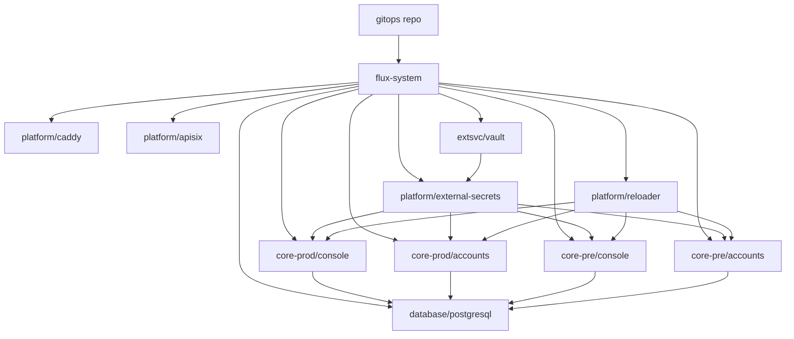

# Single-Node k3s + Flux GitOps Platform

> Cross-repo implementation plan for the Cloud-Neutral AI Infra Platform mini PaaS.

## Goal

Build a single-node `k3s` platform that hosts `prod` and `pre` environments in the same cluster, with:

- `FluxCD` as the control plane
- `Caddy` as the ingress controller
- `APISIX` as the standalone API gateway
- `ExternalDNS` for Cloudflare DNS automation
- `Vault -> ESO -> Secret -> Reloader` as the secret chain
- `PostgreSQL` single instance with `core_prod` and `core_pre` schema isolation

## Repo Ownership

- `playbooks`: bootstrap host, install `k3s`, install `flux`, seed the cluster
- `gitops`: all Kubernetes desired state under `infra/`
- control repo: orchestration workflows, helper scripts, governance updates, design docs

## Architecture Summary

## Implementation Notes

- Root Flux sync targets `gitops/infra/clusters/prod`.
- `jp-k3s-vultr.svc.plus` uses the `k3s_platform` deployment mode.
- `infra/clusters/prod` owns shared namespaces plus child `Kustomization` objects for:
  - `infra/platform`
  - `infra/infrastructure`
  - `infra/apps/core/console/prod`
  - `infra/apps/core/accounts/prod`
  - `infra/clusters/pre`
- `infra/clusters/pre` only creates child `Kustomization` objects for:
  - `infra/apps/core/console/pre`
  - `infra/apps/core/accounts/pre`
- `prod` uses `replicas: 2`; `pre` uses `replicas: 1`.
- `Vault` and `PostgreSQL` are single-instance stateful services with PVC-backed storage.
- `ansible/inventory.ini` may hold secret references such as `k3s_platform_git_private_key_path`, but not plaintext secret material.

## Rollout Order

1. Host precheck and bootstrap `k3s` with `playbooks/init_k3s_single_node_gitops.yml`.
2. Install `helm` and `flux` CLI.
3. Create `flux-system` and install Flux controllers.
4. Bootstrap the in-cluster `Vault` server before GitOps source registration.
5. Prepare Flux GitOps auth material and create the git auth secret.
6. Apply the root `GitRepository` + `Kustomization` and reconcile `platform-root`.
7. Let Flux create the platform namespaces and reconcile `platform`, `infrastructure`, `core-prod`, and `core-pre`.
8. Validate ingress, DNS, secret sync, and rollout health.

## Validation Baseline

- `cd /Users/shenlan/workspaces/cloud-neutral-toolkit/playbooks && ansible-playbook -i inventory.ini init_k3s_single_node_gitops.yml --syntax-check`
- `cd /Users/shenlan/workspaces/cloud-neutral-toolkit/playbooks && ansible-playbook -i inventory.ini init_k3s_single_node_gitops.yml -l jp-k3s-vultr.svc.plus -D -C -e @vars/k3s_platform_svc_plus.yml`
- `cd /Users/shenlan/workspaces/cloud-neutral-toolkit/playbooks && ansible-playbook -i inventory.ini init_k3s_single_node_gitops.yml -l jp-k3s-vultr.svc.plus -D -e @vars/k3s_platform_svc_plus.yml`
- `cd /Users/shenlan/workspaces/cloud-neutral-toolkit/gitops && kustomize build infra/clusters/prod`
- `cd /Users/shenlan/workspaces/cloud-neutral-toolkit/gitops && kustomize build infra/clusters/pre`
- `cd /Users/shenlan/workspaces/cloud-neutral-toolkit/gitops && helm template console-prod helm/app-service -f infra/apps/core/console/base/values.yaml -f infra/apps/core/console/prod/values.yaml`
- `cd /Users/shenlan/workspaces/cloud-neutral-toolkit/gitops && helm template accounts-pre helm/app-service -f infra/apps/core/accounts/base/values.yaml -f infra/apps/core/accounts/pre/values.yaml`
- `kubectl get gitrepositories,kustomizations,helmreleases -A`
