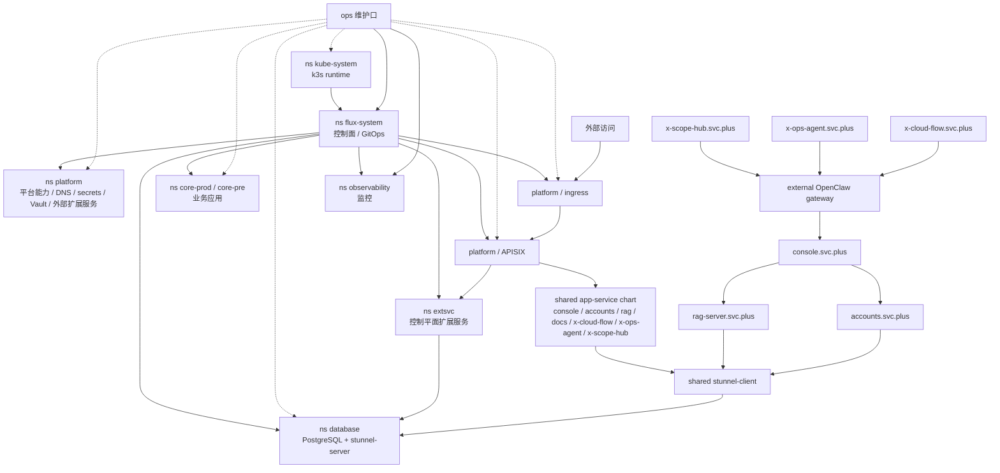

# Single-Node k3s + Flux GitOps Platform

> Cross-repo implementation plan for the Cloud-Neutral AI Infra Platform mini PaaS.

## Goal

Build a single-node `k3s` platform that hosts `prod` and `pre` environments in the same cluster, with:

- `FluxCD` as the control plane
- `Caddy` as the ingress controller
- `APISIX` as the standalone API gateway
- `ExternalDNS` for Cloudflare DNS automation
- `Vault -> ESO -> Secret -> Reloader` as the secret chain
- `PostgreSQL` single instance with `core_prod` and `core_pre` schema isolation
- `app-service` as the shared chart contract for `console`, `accounts`, `rag-server`, `docs`, `x-cloud-flow`, `x-ops-agent`, and `x-scope-hub`

## Repo Ownership

- `playbooks`: bootstrap host, install `k3s`, install `flux`, seed the cluster
- `gitops`: all Kubernetes desired state under `infra/`
- control repo: orchestration workflows, helper scripts, governance updates, design docs

## Architecture Summary

## Implementation Notes

- Root Flux sync targets `gitops/apps/clusters/prod`.
- `jp-xhttp-contabo.svc.plus` uses the `k3s_platform` deployment mode.
- The logical target namespace model is:
  - `kube-system`
  - `flux-system`
  - `platform`
  - `core`
  - `database`
  - `observability`
- Current implementation may still materialize `core` as `core-prod` / `core-pre`.
- Current implementation may still materialize external service workloads such as `Vault` under `extsvc`, but the target architecture folds that responsibility into `platform`.
- `apps/clusters/prod` owns shared namespaces plus child `Kustomization` objects for:
  - direct Ansible-managed platform bootstrap outputs
  - `apps/core/console/prod`
  - `apps/core/accounts/prod`
  - `apps/core/stunnel-client/prod`
  - `apps/clusters/pre`
- `apps/clusters/pre` only creates child `Kustomization` objects for:
  - `apps/core/console/pre`
  - `apps/core/accounts/pre`
  - `apps/core/stunnel-client/pre`
- `app-service` is the reusable chart for the core and extsvc workloads, but `rag-server` and `docs` need chart hooks for mounted config/repo paths.
- `console`, `x-cloud-flow`, `x-ops-agent`, and `x-scope-hub` keep the external OpenClaw gateway as a separate integration boundary; do not fold that dependency into the shared chart contract.
- `console` frontend routes for `docs` and `xworkmate` should stay explicit as first-class dependencies, separate from the `accounts` / `rag-server` backend chain.
- `console` build args stay in CI image publishing; Helm should manage runtime env, ingress, and a probe path of `/` rather than own build-time `NEXT_PUBLIC_*` values.
- `stunnel-client` remains a separate deploy unit in each business namespace, while `stunnel-server` is a separate deploy unit in `database`.
- `core-prod` / `core-pre` and `extsvc` are the intended namespace split for the app workloads.
- `prod` uses `replicas: 2`; `pre` uses `replicas: 1`.
- `Vault` and `PostgreSQL` are single-instance stateful services with PVC-backed storage.
- `ansible/inventory.ini` may hold secret references such as `k3s_platform_git_private_key_path`, but not plaintext secret material.

## Rollout Order

The bootstrap interface is now intentionally split into four stages:

1. `k3s` install and host preparation
2. Vault bootstrap integration with `VAULT_URL`, `VAULT_TOKEN`, and optional `VAULT_NAMESPACE`
3. FluxCD bootstrap with `GITOPS_REPO` and `GITOPS_AUTH_MODE`
4. `k3s` cluster and GitOps state validation

1. Host precheck and bootstrap `k3s` with `playbooks/k3s_platform_bootstrap_with_gitops.yml`.
2. Install `helm` and `flux` CLI.
3. Create `flux-system` and install Flux controllers.
4. Bootstrap the in-cluster `Vault` server before GitOps source registration.
5. Prepare Flux GitOps auth material and create the git auth secret.
6. Apply the root `GitRepository` + `Kustomization` and reconcile `platform-root`.
7. Let Flux create the platform namespaces and reconcile `platform`, `infrastructure`, `core-prod`, `core-pre`, `extsvc`, and `database`.
8. Validate ingress, DNS, secret sync, rollout health, and cluster/GitOps state.

## Validation Baseline

- `cd /Users/shenlan/workspaces/cloud-neutral-toolkit/playbooks && ansible-playbook -i inventory.ini k3s_platform_bootstrap_with_gitops.yml --syntax-check`
- `cd /Users/shenlan/workspaces/cloud-neutral-toolkit/playbooks && ansible-playbook -i inventory.ini k3s_platform_bootstrap_with_gitops.yml -l jp-xhttp-contabo.svc.plus -D -C`
- `cd /Users/shenlan/workspaces/cloud-neutral-toolkit/playbooks && ansible-playbook -i inventory.ini k3s_platform_bootstrap_with_gitops.yml -l jp-xhttp-contabo.svc.plus -D`
- `cd /Users/shenlan/workspaces/cloud-neutral-toolkit/gitops && kustomize build apps/clusters/prod`
- `cd /Users/shenlan/workspaces/cloud-neutral-toolkit/gitops && kustomize build apps/clusters/pre`
- `cd /Users/shenlan/workspaces/cloud-neutral-toolkit/artifacts/oci/charts && helm template console-prod ./apps/app-service -f /Users/shenlan/workspaces/cloud-neutral-toolkit/gitops/apps/core/console/base/values.yaml -f /Users/shenlan/workspaces/cloud-neutral-toolkit/gitops/apps/core/console/prod/values.yaml`
- `cd /Users/shenlan/workspaces/cloud-neutral-toolkit/artifacts/oci/charts && helm template accounts-pre ./apps/app-service -f /Users/shenlan/workspaces/cloud-neutral-toolkit/gitops/apps/core/accounts/base/values.yaml -f /Users/shenlan/workspaces/cloud-neutral-toolkit/gitops/apps/core/accounts/pre/values.yaml`
- `cd /Users/shenlan/workspaces/cloud-neutral-toolkit/artifacts/oci/charts && helm template postgresql ./postgresql -f /Users/shenlan/workspaces/cloud-neutral-toolkit/gitops/services/database/postgresql/values.yaml`
- `cd /Users/shenlan/workspaces/cloud-neutral-toolkit/artifacts/oci/charts && helm template observability ./observability -f /Users/shenlan/workspaces/cloud-neutral-toolkit/gitops/apps/monitor/observability-stack/values.yaml`
- `kubectl get gitrepositories,kustomizations,helmreleases -A`
