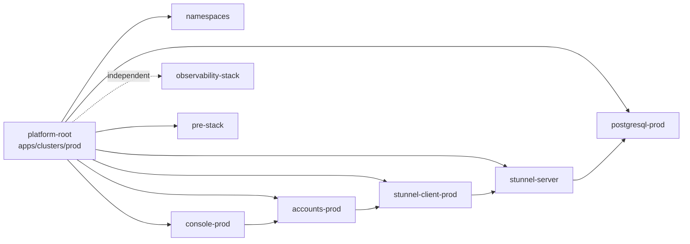
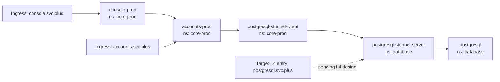

# PROD GitOps Service Chain Split

## Scope

This document defines the first executable split for the PROD business line in GitOps.

Target business chain:

- `console-prod -> accounts-prod -> stunnel-client -> stunnel-server -> postgresql`

Execution constraints confirmed in this round:

- `stunnel-server` is an independent `Deployment`
- `stunnel-client` is an independent `Deployment`
- `stunnel-server` and `postgresql` run in the same namespace: `database`
- `stunnel-client` belongs to the PROD business line and runs in `core-prod`
- `stunnel-client` for PRE belongs to the PRE business line and runs in `core-pre`
- `observability-stack` is not a runtime dependency for PROD or PRE
- PROD and PRE are relatively independent except for the shared database service layer

Notes for this step:

- Existing console/accounts HTTP ingress remains in scope:
  - `console.svc.plus`
  - `accounts.svc.plus`
- `postgresql.svc.plus` is a target state but not executed in this step because it requires an explicit L4/TCP exposure design instead of a standard HTTP Ingress
- Existing application DB contract remains unchanged in this step:
  - current bootstrap uses `DB_NAME=postgres`
  - current app overlays still rely on schema separation such as `core_prod`
  - dedicated logical database names are target-state but not executed in this step:
    - PROD: `account`, `knowledge`
    - PRE: `preview-account`, `preview-knowledge`

## 1. PROD Kustomization dependsOn Design

Design intent:

- `postgresql-prod` is the database base layer in namespace `database`
- `stunnel-server` is the TLS entry layer in namespace `database`
- `stunnel-client-prod` is the in-cluster DB access layer for PROD in namespace `core-prod`
- `accounts-prod` must wait for `stunnel-client-prod`
- `console-prod` must wait for `accounts-prod`
- `pre-stack` stays enabled and must remain reconcilable, so PRE receives the same client-side split pattern for compatibility

## 2. Corresponding Runtime Topology

Runtime intent:

- applications inside `core-prod` do not connect directly to `postgresql.database.svc`
- `accounts-prod` connects to `postgresql-stunnel-client.core-prod.svc:15432`
- `stunnel-client` connects to `postgresql-stunnel-server.database.svc:5433`
- `stunnel-server` connects to `postgresql.database.svc:5432`

## 3. Actual gitops/apps/clusters/prod Split Scheme

### 3.1 PROD cluster kustomizations

- `apps/clusters/prod/postgresql-prod-kustomization.yaml`
  - path: `./services/database/postgresql`
- `apps/clusters/prod/stunnel-server-kustomization.yaml`
  - path: `./services/database/stunnel-server`
  - dependsOn: `postgresql-prod`
- `apps/clusters/prod/stunnel-client-prod-kustomization.yaml`
  - path: `./apps/core/stunnel-client/prod`
  - dependsOn: `stunnel-server`
- `apps/clusters/prod/accounts-prod-kustomization.yaml`
  - dependsOn: `stunnel-client-prod`
- `apps/clusters/prod/console-prod-kustomization.yaml`
  - dependsOn: `accounts-prod`

### 3.2 Support paths added under gitops

- `services/database/postgresql`
  - contains the shared PostgreSQL Helm release resources and the `postgresql-auth` ExternalSecret
- `services/database/stunnel-server`
  - contains only server-side TLS proxy resources in namespace `database`
- `apps/core/stunnel-client/base`
  - shared client-side TLS proxy manifests
- `apps/core/stunnel-client/prod`
  - PROD overlay in namespace `core-prod`
- `apps/core/stunnel-client/pre`
  - PRE overlay in namespace `core-pre`

### 3.3 PRE compatibility

PRE is not the deployment focus of this step, but it remains referenced by `platform-root`.

To keep root reconciliation healthy:

- add `apps/clusters/pre/stunnel-client-pre-kustomization.yaml`
- update `accounts-pre` to depend on `stunnel-client-pre`
- keep `console-pre -> accounts-pre`
- keep PRE relatively independent from PROD at the application layer
- only share the database service layer:
  - `postgresql`
  - `stunnel-server`

### 3.4 Bootstrap changes required outside gitops

The bootstrap layer must be aligned with the runtime chain:

- create `postgresql-ghcr-pull` in:
  - `database`
  - `core-prod`
  - `core-pre`
- update bootstrap `accounts-env` in:
  - `core-prod`
  - `core-pre`

New values:

- `DB_HOST=postgresql-stunnel-client.<namespace>.svc.cluster.local`
- `DB_PORT=15432`

Where:

- PROD namespace is `core-prod`
- PRE namespace is `core-pre`

## Execution Order

1. Write this design into the control-plane repo
2. Add new GitOps resource paths for `postgresql`, `stunnel-server`, and `stunnel-client`
3. Rewire `apps/clusters/prod` and `apps/clusters/pre` to the new dependsOn chain
4. Align bootstrap secrets so the runtime path matches the GitOps path
5. Validate with `kustomize` and `ansible-playbook --syntax-check`
