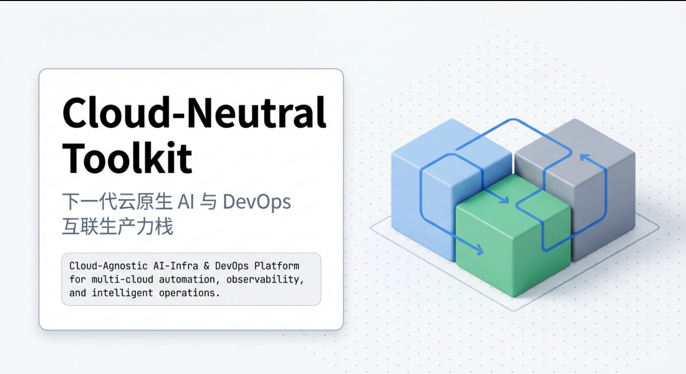
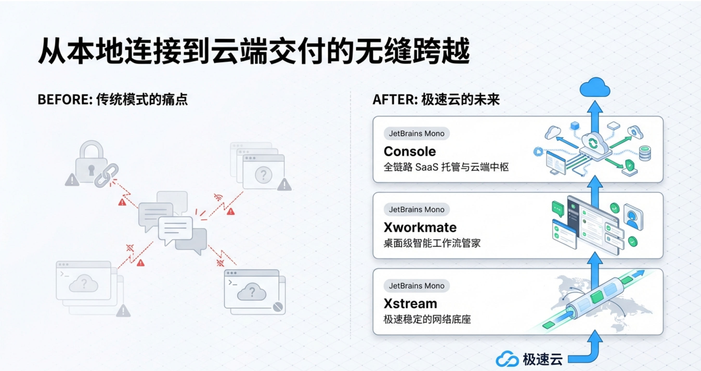
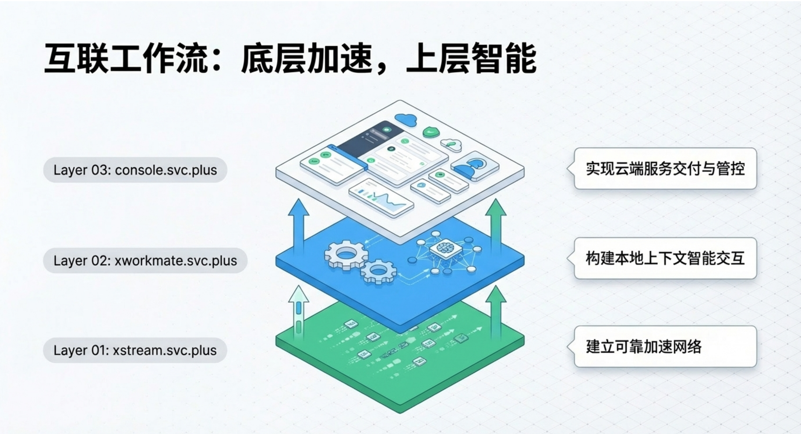
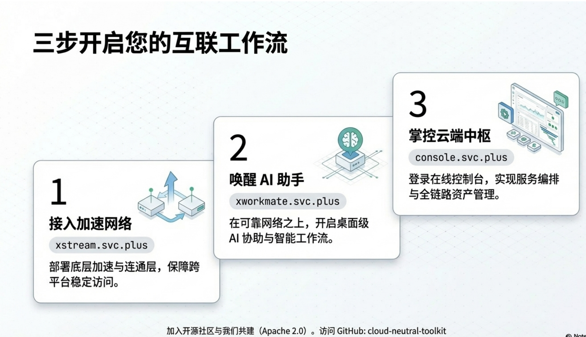

# ☁️ X-Stack Toolkit

Cloud-Neutral Toolkit is building a connected productivity stack across network acceleration, AI assistance, and cloud services.

From **Xstream** acceleration, to the **Xworkmate** AI assistant, to **console.svc.plus** cloud services, the toolkit provides one connected workflow for secure access, faster connectivity, and online operations.

**Flow:** Xstream acceleration -> Xworkmate AI assistant -> console.svc.plus cloud services

## Product Overview

- **Xstream**: network acceleration and connectivity layer for stable access, routing, and performance.
- **Xworkmate**: AI assistant application built on top of the accelerated connection layer for daily work, collaboration, and intelligent workflows.
- **console.svc.plus**: cloud-hosted online services for account access, management, configuration, and future service orchestration.

Together, they form a complete path from local connectivity to intelligent interaction and then to cloud-side service delivery.

## Ecosystem Repositories

| Repository | Role | Quick Access |
| :--- | :--- | :--- |
| **xstream.svc.plus** | Connectivity, proxy, and acceleration foundation. | [Source](https://github.com/cloud-neutral-toolkit/xstream.svc.plus) |
| **xworkmate.svc.plus** | AI assistant app and experience layer. | [Source](https://github.com/cloud-neutral-toolkit/xworkmate.svc.plus) |
| **console.svc.plus** | Online console and cloud service portal. | [Visit Console](https://console.svc.plus/) |
| **rag-server.svc.plus** | Retrieval-Augmented Generation backend services. | [Source](https://github.com/cloud-neutral-toolkit/rag-server.svc.plus) |
| **accounts.svc.plus** | Identity, login, and account infrastructure. | [Source](https://github.com/cloud-neutral-toolkit/accounts.svc.plus) |

## Experience Snapshot

### Platform and Delivery View

  
  

### Workflow and Adoption Path

  
  

## How It Fits Together

1. **Start with Xstream** to establish accelerated and reliable network access.
2. **Use Xworkmate** on top of that connection to interact with AI capabilities in a smoother, more dependable environment.
3. **Manage everything through console.svc.plus** for cloud-side access, service control, and online operations.

This makes the overall platform suitable for users who need a practical path from connectivity, to AI productivity, to managed cloud services.

## Quick Start

1. Visit [console.svc.plus](https://console.svc.plus/) to access the online service entry point.
2. Explore [xworkmate.svc.plus](https://github.com/cloud-neutral-toolkit/xworkmate.svc.plus) for the AI assistant experience.
3. Use [xstream.svc.plus](https://github.com/cloud-neutral-toolkit/xstream.svc.plus) for the acceleration and connectivity layer.

---

🤝 Community & License
We welcome contributions and collaboration.

Copyright © 2024-2026 Cloud-Neutral Toolkit. Licensed under the Apache 2.0 License.

