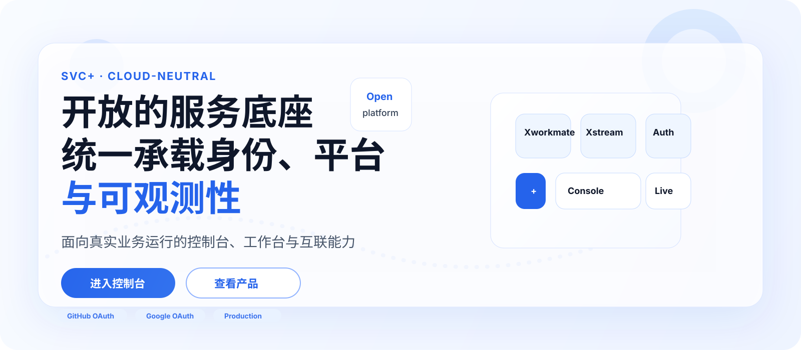

# SVC+ · Cloud-Neutral Services

**开放的服务底座，统一承载身份、平台与可观测性。**

<a href="https://console.svc.plus/" target="_blank">进入控制台 / Console</a> ·
<a href="https://console.svc.plus/products/xworkmate" target="_blank">Xworkmate</a> ·
<a href="https://console.svc.plus/products/xstream" target="_blank">Xstream Platform</a>

  

---

## 最新发布

| 环境 | 最新发布 | 说明 |
| --- | --- | --- |
| `sit` |  | 验证集成，检查服务间联动、权限和基础可用性。 |
| `uat` |  | 预发验证，确认镜像、配置和发布流程在正式上线前无误。 |
| `prod` |  | 生产发布，承载对外稳定运行的正式版本。 |

> 三张卡片会保持简洁，重点是让你一眼看到每条环境线的最新发布入口。

## 中文

`ai-workspace-services` 是面向真实业务运行的服务组织主页，聚合统一控制台、身份认证、AI 工作台与跨网络互联能力。

- `Open-platform`：开放平台与基础设施能力中心
- `Xworkmate`：AI 工作空间，面向持续推进的任务协作
- `Xstream Platform`：海外 AI 服务加速与私有网络互联
- `Auth`：支持 `GitHub OAuth` 与 `Google OAuth`

所有展示内容都对应实际在线运行的服务，不是 demo。

### 环境速览

- `sit`: 验证集成
- `uat`: 预发验证
- `prod`: 生产发布

## English

`ai-workspace-services` is the organization home for real production services. It brings together the console, identity, AI workspace, and connectivity capabilities behind the platform.

- `Open-platform`: the platform and infrastructure core
- `Xworkmate`: an AI workspace for persistent task execution
- `Xstream Platform`: overseas AI acceleration and private network interconnect
- `Auth`: supports `GitHub OAuth` and `Google OAuth`

Everything shown here points to live services, not a demo.

### Environment Snapshot

- `sit`: integration checks
- `uat`: pre-release validation
- `prod`: production release

---

## 入口 / Entry Points

| 项目 | 说明 | 链接 |
| --- | --- | --- |
| `Console` | 统一入口与服务导航 | https://console.svc.plus/ |
| `Xworkmate` | AI 工作空间 | https://console.svc.plus/products/xworkmate |
| `Xstream Platform` | 海外 AI 服务加速与互联 | https://console.svc.plus/products/xstream |
